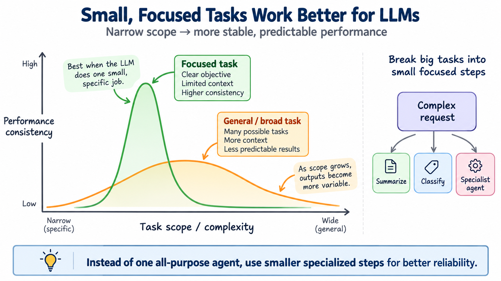
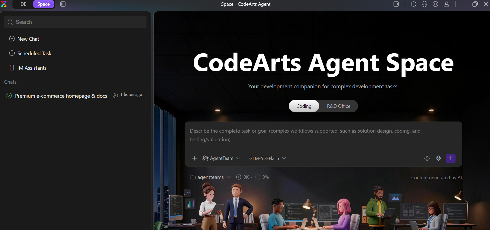
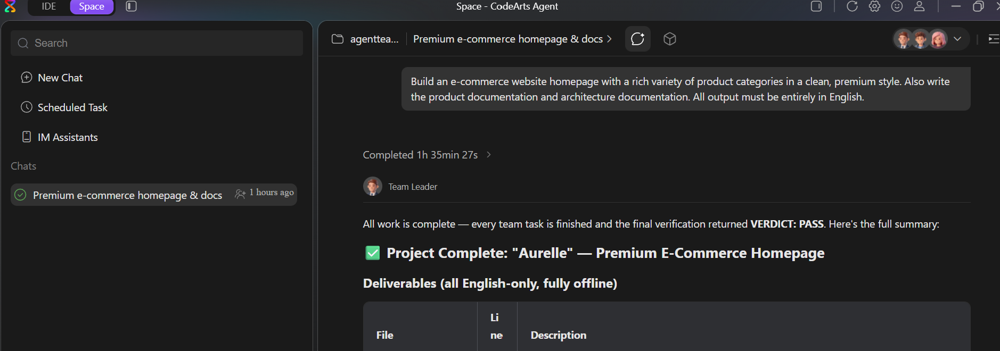
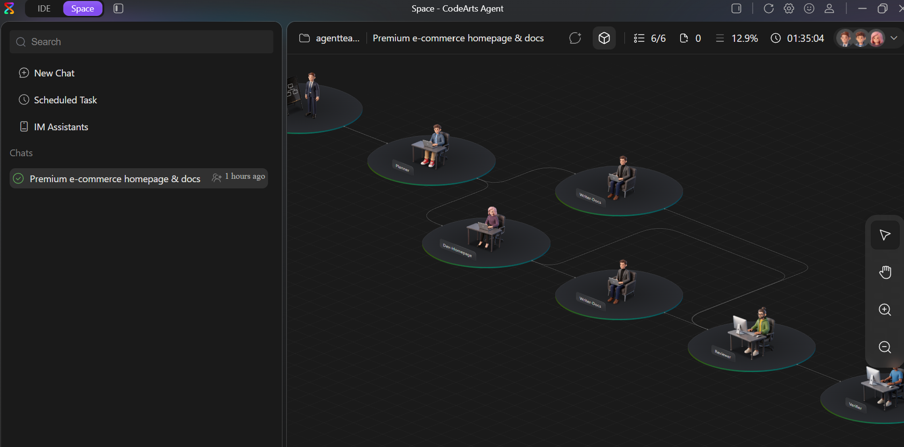
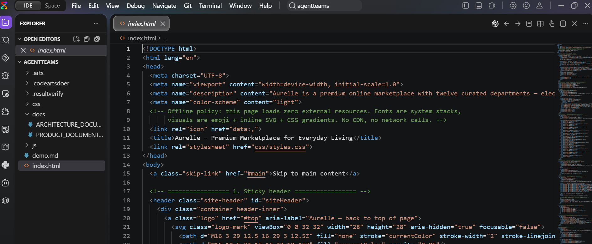
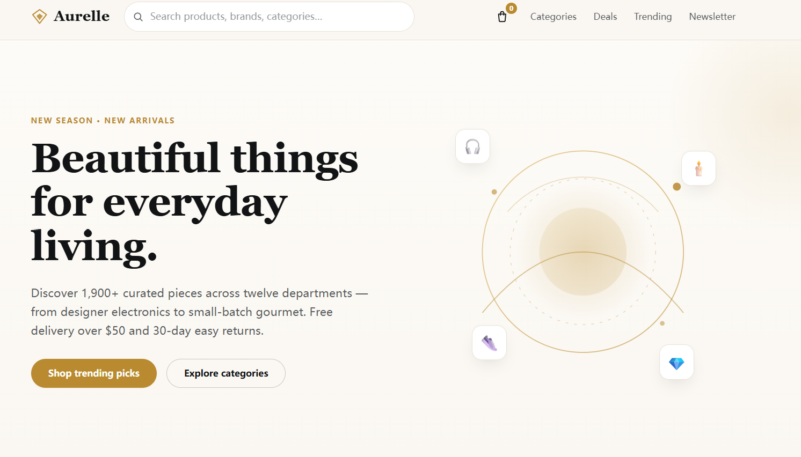
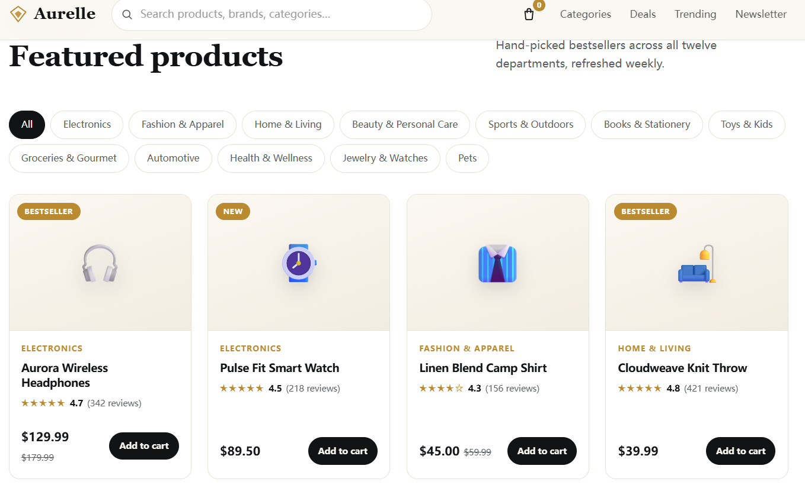

# Agent Team Collaboration Demo

> Language: **English** ｜ [简体中文](agentteam_readme.zh-CN.md)
>
> Video (4 min 17 s, 1152×720, ~58 MB, click to download):
> [agentteams-demo.mp4](https://github.com/hhuang37/codearts-agent-demos/releases/download/v0.3.0/agentteams-demo.mp4)

## What This Demo Shows

- **Huawei's development methodology, built in:** AgentTeam is Huawei's preconfigured multi-agent development mode. It brings Huawei's software development methodology to complex development tasks.
- **Automatic task breakdown and execution:** This demo uses AgentTeam to develop an e-commerce website. AgentTeam automatically splits the work into subtasks and assigns each to an independent subagent, coordinating the process end to end.

## Benefits of the Subagent Development Approach



Breaking complex development into small, clearly scoped tasks lets each subagent focus on one job, which can help make results more consistent and predictable. This is one of the benefits of using the subagent approach in AgentTeam.

> “The most magical moments out of AI building come about ... close to the edge of the model capability.”
>
> — Usama Bin Shafqat, NotebookLM AI Engineer, [interview clip (01:10:07)](https://www.youtube.com/watch?v=v1mOIdH9q7k&t=4207s)

By focusing each subagent on a clearly defined task, AgentTeam can keep experimenting and explore the model’s capabilities further.

## Steps

1. **Choose the mode:** In CodeArts IDE, switch to **Space**, select **Coding**, then choose **AgentTeam** below the input box.

   

2. **Send a request:** Enter a task that combines several work items, for example:

   ```text
   Build an e-commerce website homepage with a rich variety of product categories in a clean, premium style. Also write the product documentation and architecture documentation. All output must be entirely in English.
   ```

   

3. **Track progress:** Switch to the visual view to see the task breakdown. Use the task list or task overview to follow progress.

   

4. **Review the results:** Inspect the generated code and page previews in the IDE. Accept or undo changes as needed.

   

   

   

## Reference

[Multi-task parallelism (Agent Team) user guide](https://support.huaweicloud.com/usermanual-codeartsagent/codeartsagent_ug_0022.html)
