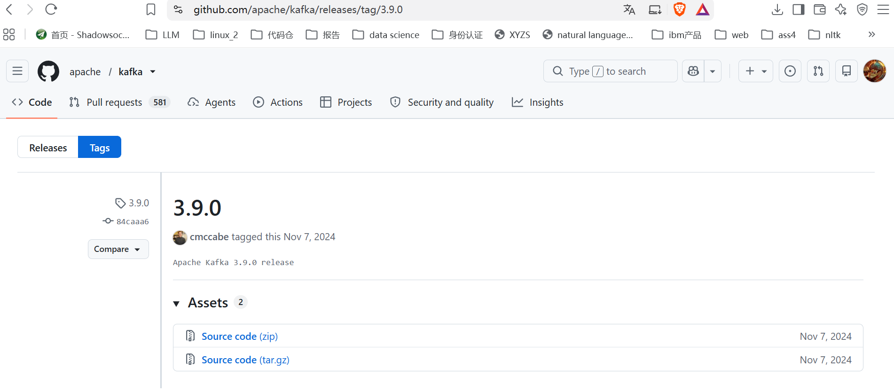
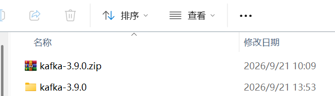
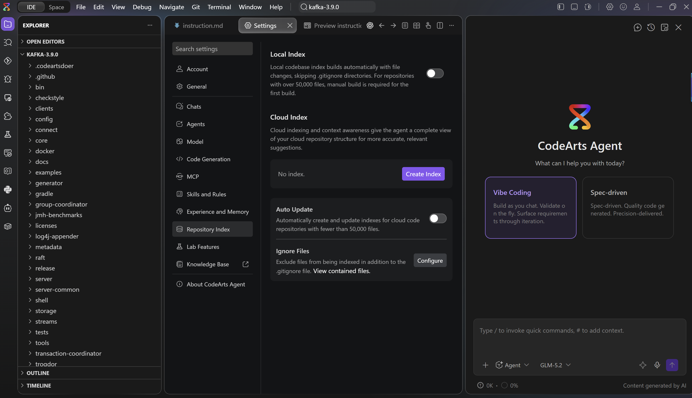
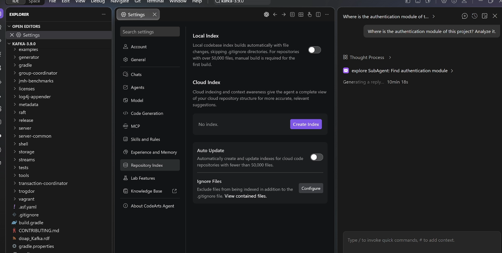
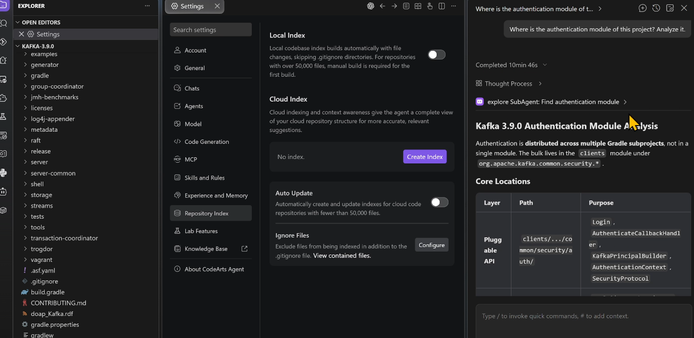
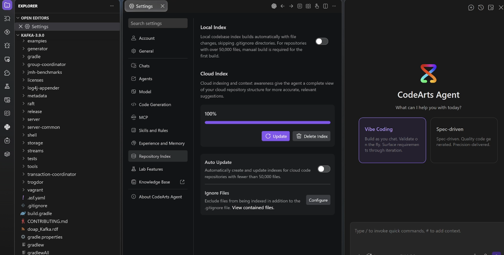
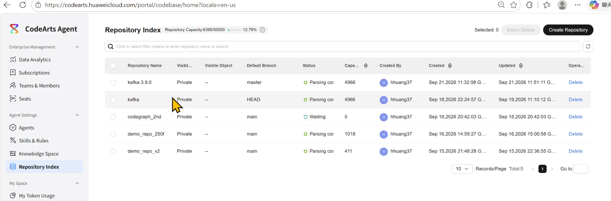
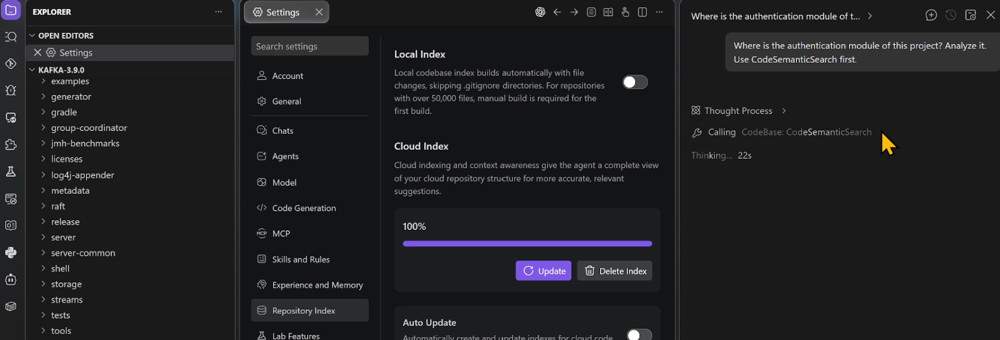
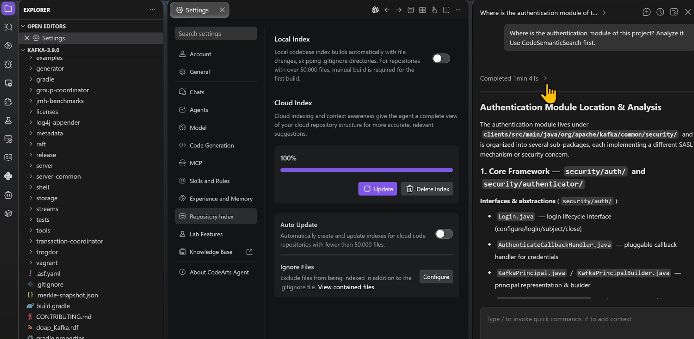

# CodeArts 代码索引对照实验（Kafka 3.9.0 手动实操）

> 语言：**中文** ｜ [English](README.en.md)

## 1. 下载合适的project，本次案例下载开源的apache kafka开源项目

- 选择kafka 3.9.0版本，下载链接： https://github.com/apache/kafka/releases/tag/3.9.0

  

- 本地解压：

  

## 2. 打开codearts agent，选择kafka路径为project，检查本地索引开关是否是关闭的



## 3. 打开右侧边栏，登录账号，选择合适模型，输入prompt：

```
Where is the authentication module of this project? Analyze it.
```

等待完成，检查结果



可以看到上图，会启动一个subagent去读取project的文件

测试完成记录时间 10 min 46 s：



## 4. 打开索引开关，等待索引创建





## 5. 等待索引创建完成之后再次提问，输入prompt，观察结果：

```
Where is the authentication module of this project? Analyze it.
```

注意：有时正常提问不一定触发索引查询，这个时候需要稍微调整一下prompt：

```
Where is the authentication module of this project? Analyze it. Use CodeSemanticSearch first.
```

正常情况下，可以看到思考过程开始就会启动CodeSemanticSearch，而不是启动explore SubAgent去读取项目文件，如下图



等待完成，检查结果



## 对照结果

| 索引开关 | 实际触发的路径 | 耗时 |
| --- | --- | --- |
| 关闭 | 启动 explore SubAgent 逐个读项目文件 | 10 min 46 s |
| 开启 | 思考一开始就调用 CodeSemanticSearch 语义检索 | 1 min 41 s |

同一个问题，索引开启后耗时约为关闭时的 1/6.4（646 s → 101 s）。
