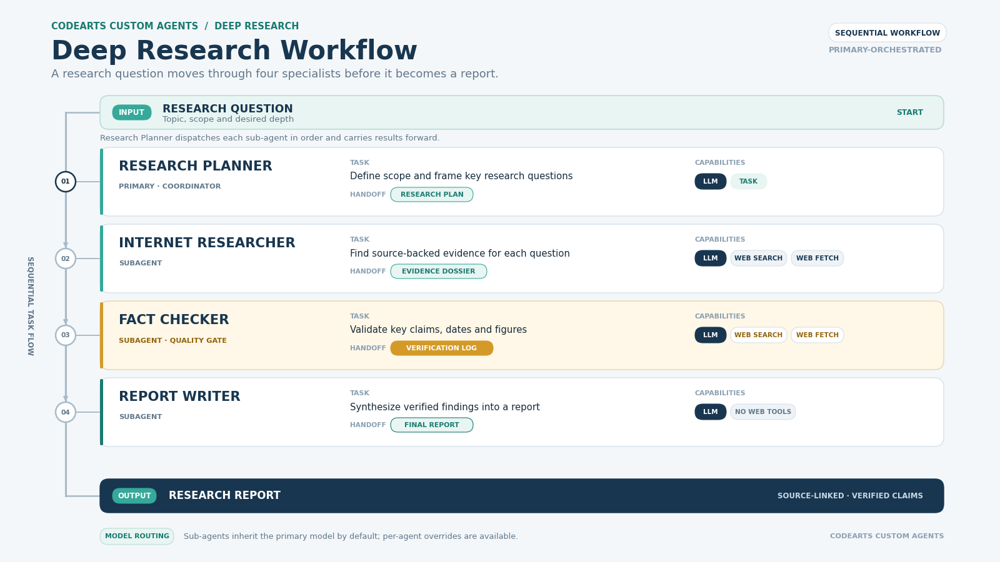

# Demo 设计与讲解稿

## 一句话介绍

让一个研究问题依次经过研究规划、联网取证、事实核查和报告综合，展示“多个有职责边界的 Agent 如何交接产物”。

## 流程映射

| DeepLearning.AI / CrewAI 参考图里的角色 | CodeArts 配置 | 输入 | 交付物 |
|---|---|---|---|
| Planner | deep-research-planner（primary） | 用户主题和范围 | 研究问题、检索方向、报告结构；并负责调度 |
| Researcher | internet-researcher（subagent） | 研究计划 | 带来源 URL、日期和证据摘要的研究材料 |
| Fact Checker | fact-checker（subagent） | 研究材料及主张 | 已支持、部分支持、冲突、未核实状态 |
| Report Writer | report-writer（subagent） | 计划、证据、核查表 | 附来源和限制说明的最终报告 |

## 架构图

[Editable SVG source](../images/deep-research-workflow.svg)

## 演示讲稿（约 2 分钟）

1. 先给出一个开放但有限定的研究问题，例如“中国公共图书馆儿童阅读服务”。
2. 展示主智能体把问题拆成研究子问题、证据需求和检索方向。
3. 展示研究员返回的来源证据表，关注来源类型、发布日期和 URL。
4. 展示事实核查员如何把活动宣传中的“做过活动”与“活动有效”区分开。
5. 查看最终报告是否保留来源、争议和未核实项。
6. 解释角色职责、工具权限和模型可以分别配置；再强调成本必须实测，不能默认多 Agent 更省。

## 试跑验收点

- [ ] 四个阶段在主智能体的回答或执行记录中可辨认。
- [ ] 主智能体按研究员、核查员、撰写员顺序调用子智能体。
- [ ] 研究材料包含可访问的来源链接，而不是只有结论。
- [ ] 核查结果没有把“未找到反证”误报成“已支持”。
- [ ] 最终报告里的重要主张能追溯到来源，并保留冲突与限制。
- [ ] 未授权外部操作（例如联系机构、发布、写入系统）不会发生。

## CodeArts 与 CrewAI 的差异

CrewAI 课程展示的是 Crew / Flow 工作流；这里使用 CodeArts 项目级 Markdown 自定义智能体和 task 工具做轻量映射。分工和交接靠主智能体提示词组织，不能当成 CrewAI 的原生 sequential process，也不是硬性状态机。运行时应检查子智能体是否被调用、交付是否符合格式。