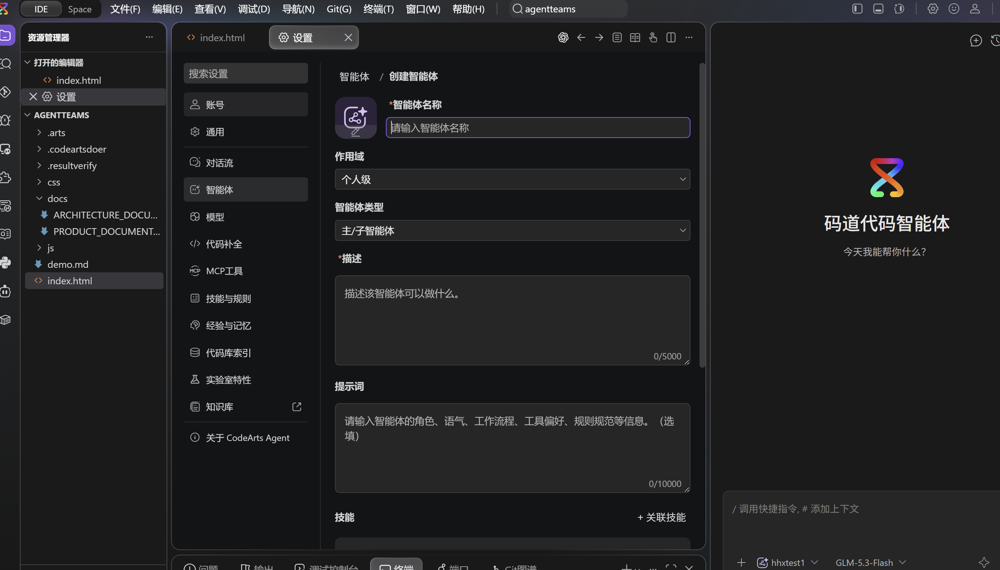
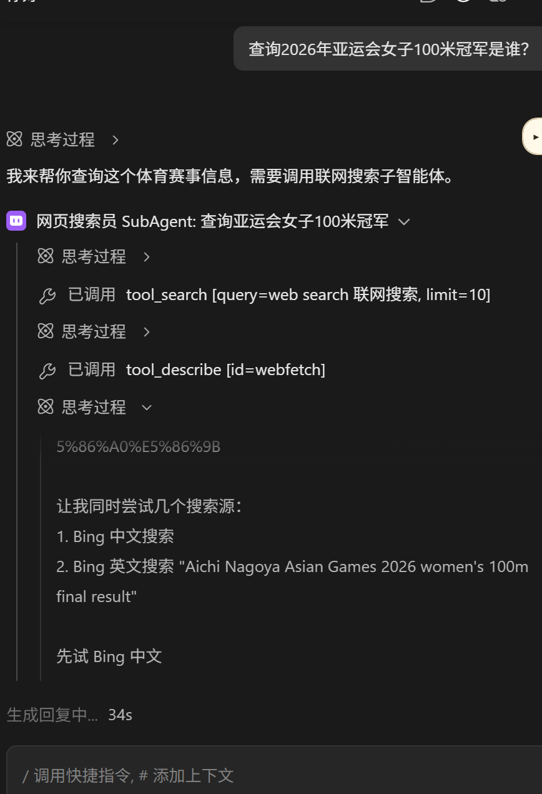

# 自定义智能体主/子协作配置指南

> **目标案例**：主智能体自身没有联网能力，把"查询2026年亚运会女子100米冠军是谁？"这类实时问题委派给配有搜索能力的子智能体，最终返回带来源的答案。
>
> 本文先讲 **IDE 界面配置**（推荐、日常够用），再讲 **本地 Markdown 配置**（能力最全），最后附**命令行测试方式**（可选进阶）与失败排查。所有结论均经真机验证（2026-09-29，验证记录见附录）。

## 一、原理

主智能体通过 **task 工具（子任务）** 派活：调用时指定"任务描述 + 子智能体的 name"，子智能体带着自己的工具集执行完把结果交回主智能体。主智能体自己不开搜索工具，也能拿到联网结果。

三个决定成败的细节：

1. **子智能体的 description 是调度依据**——主智能体靠它判断"该不该派给这个子智能体"，必须写明"联网搜索""实时信息"这类能力词。
2. **主智能体的提示词要点名子智能体的准确名称**，并写明"遇到实时信息问题必须调用它"，否则模型可能自己硬答。
3. **子智能体不会出现在聊天智能体选择列表里**（界面和本地路线都是如此），看不到 ≠ 没生效，它只被主智能体调用。

## 二、路线一：IDE 界面配置（推荐，不写文件）

入口：**设置 → 智能体 → 创建智能体**。表单字段：智能体名称 / 作用域 / 智能体类型 / 描述 / 提示词 / 技能。仅基础版/专业版套餐可建云端智能体。



### 1. 创建子智能体

| 字段 | 填写 |
|---|---|
| 智能体名称 | `网页搜索员` |
| 作用域 | 个人级 |
| 智能体类型 | **子智能体** |
| 描述 | `联网搜索实时信息的子智能体：查询新闻、比赛结果、最新数据，返回带来源URL和查询日期的答案。` |
| 技能 | 暂不关联 |

提示词：

```text
你是联网搜索子智能体。收到问题后先搜索，再返回结果。
要求：
- 用中文返回：直接答案、关键证据、来源名称与URL、本次查询日期。
- 时效性强的问题优先近期且日期明确的来源。
- 查不到就如实说"未查到"，不要编造。
```

### 2. 创建主智能体

| 字段 | 填写 |
|---|---|
| 智能体名称 | `问答调度员` |
| 作用域 | 个人级 |
| 智能体类型 | **主智能体** |
| 描述 | `自己不联网、把实时信息问题委派给网页搜索员子智能体的问答主智能体。` |

提示词：

```text
你是问答主智能体。你自身没有联网搜索能力，不能直接回答需要实时信息的问题。
规则：
- 遇到需要联网搜索的问题（新闻、比赛结果、最新数据等），必须调用子智能体【网页搜索员】，把用户的完整问题原样传给它。
- 收到结果后基于它用中文回答，保留来源链接和查询日期。
- 不要编造事实；子智能体没返回可用信息就明确说"未能查到"。
- 与实时信息无关的常识问题可以自己回答，不必调用子智能体。
```

类型下拉对照：主智能体 = `primary`；子智能体 = `subagent`；主/子智能体 = `all`（两用）。

### 3. 测试（实测效果）

1. 新建对话 → 智能体切到 **问答调度员**（列表里没有"网页搜索员"是正常的）。
2. 模型按需选择（实测用过自配 GLM-5.3-Flash）。
3. 发送验收问题：`查询2026年亚运会女子100米冠军是谁？`



上图为真机实测：主智能体回复"需要调用联网搜索子智能体"，聊天中出现**"网页搜索员 SubAgent"派发卡片**——这就是主/子调度成功的标志。参考答案：**陈妤颉，11秒06**（2026-09-25 名古屋亚运会，赛会纪录）。这个问题在模型训练数据之后，恰好证明"主智能体自己答不出来，必须靠子智能体联网"。

4. 刚创建的智能体没出现在选择器 → 设置 → 智能体 里刷新（云端智能体在 IDE 有最长 24 小时缓存）。

### 4. 界面路线的搜索能力缺口与变通（重要）

界面创建的智能体，内置工具只有 **阅读/编辑/终端/预览/访问网页**，**没有原生 websearch**。实测轨迹（见上图子智能体内部）：它先 `tool_search`/`tool_describe` 确认可用工具，发现没有搜索工具后，自行用 webfetch（访问网页）抓 Bing 中英文搜索结果页变通——**能用，但慢**（30 秒以上），且依赖搜索引擎页面可达性。三种处理：

1. **加 MCP 搜索工具（推荐）**：设置 → MCP工具 添加带搜索能力的 MCP 服务（如 Exa `https://mcp.exa.ai/mcp` 或博查搜索 MCP），配好后 MCP 工具对智能体可用，再把子智能体提示词里的"先搜索"改成点名用该工具。
2. **接受 webfetch 变通**：demo 前先完整试跑确认稳定；可在子智能体提示词里明确教它"用访问网页工具打开 `https://www.bing.com/search?q=<问题>` 从结果页提取答案"。
3. **要原生 websearch** → 用路线二（本地 Markdown）。

## 三、路线二：本地 Markdown（能力最全）

这是唯一能给子智能体开**原生 websearch**（关键词搜索，底层 Exa）的路线，配置文件随 git 版本化，适合放进 demo 仓库分发。本仓库 customagent/ 下已有现成的两个文件。

### 1. 放置文件

项目根目录下 `.codeartsdoer/agents/`，每个智能体一个 `.md` 文件。**文件名必须与 frontmatter 的 name 完全一致**，否则加载失败。个人级（跨项目生效）放 `C:\Users\<用户名>\.codeartsdoer\agents\`。

### 2. 子智能体 `.codeartsdoer/agents/web-searcher.md`（全文）

```markdown
---
name: web-searcher
mode: subagent
description: 联网搜索子智能体：使用 websearch 工具搜索实时信息，返回带来源的答案。
tools:
  "*": false
  websearch: true
  webfetch: true
---

# 角色
你是联网搜索子智能体。收到问题后使用 websearch 工具搜索，必要时用 webfetch 读取网页原文。

# 要求
- 用中文返回：直接答案、关键证据、来源名称与 URL、本次查询日期。
- 时效性强的问题优先采用近期且日期明确的来源。
- 如果搜索不到，如实说明"未查到"，不要编造。
```

### 3. 主智能体 `.codeartsdoer/agents/qa-main.md`（全文）

```markdown
---
name: qa-main
mode: primary
description: 最小演示主智能体：自身不联网，把需要实时信息的查询委派给 web-searcher 子智能体。
tools:
  "*": false
  task: true
---

# 角色
你是问答主智能体。你自身没有任何联网搜索工具，不能直接回答需要实时信息的问题。

# 规则
- 遇到需要联网搜索、实时信息、新闻、比赛结果、最新数据的问题，必须使用 task 工具调用 web-searcher 子智能体，把用户的完整问题原样传给它。
- 收到 web-searcher 的结果后，基于该结果用中文回答，并保留来源链接和查询日期。
- 不要编造事实；如果子智能体没有返回可用信息，明确说"未能查到"。
- 与实时信息无关的常识问题可以自己回答，不必调用子智能体。
```

工具表要点：`"*": false` 关掉其余工具；**主智能体至少保留 `task: true`**，否则没有调度能力；`mode` 不写默认按 subagent 处理，建议显式写。

### 4. 试跑

1. 用 CodeArts IDE 打开 `customagent` 作为项目根目录（或把两个 md 复制进你当前项目的 `.codeartsdoer/agents/`）。
2. 新建对话，聊天框切换到主智能体 **qa-main**。
3. 发送：`查询2026年亚运会女子100米冠军是谁？`
4. **成功标志**：回复过程出现子智能体调用记录，最终答案带来源链接和查询日期。

## 四、命令行测试方式（可选进阶）

日常在 IDE 界面测试即可；命令行适合反复验证、排查加载问题或做自动化，一般可以不用。

**检查加载**（最快，不耗 token，写完 Markdown 文件后先跑这个）：

```bat
cd <项目目录>
set CODEARTS_CLI_AK=<你的AK>
set CODEARTS_CLI_SK=<你的SK>
codearts agent list
```

输出出现 `qa-main (primary)`、`web-searcher (subagent)` 即语法和命名正确；agent 不在列表 = 文件名不等于 name 或 YAML 写错。CLI 子命令强制 AK/SK（在 portal 的 [CLI 授权页](https://codearts.huaweicloud.com/portal/settings/cli-auth)申请，这只是登录校验）；不想配密钥就直接输 `codearts` 进 TUI，首次会引导浏览器登录。

**端到端运行**：

```bash
codearts run --agent qa-main -m <provider/model> "查询2026年亚运会女子100米冠军是谁？"
```

成功标志 = 输出出现 "Web-Searcher Agent" 派发行（• 进行中 / ✓ 完成）。加 `--format json` 看完整工具调用事件流；`codearts session` 列会话、`codearts export <sessionID>` 导出复盘。

**单独调试子智能体**：直接 `--agent web-searcher` 会告警 "is a subagent... Falling back"。想单独测它，临时把 frontmatter 的 `mode` 改成 `all`（既可被调用也可直接跑），测完改回。

## 五、失败排查清单

| 现象 | 原因与处理 |
|---|---|
| 本地 agent 不在 `codearts agent list` | 文件名 ≠ frontmatter 的 name，或 YAML 语法错误 |
| task 报 `Unknown agent type: xxx` | 调用的名称与实际加载的 name 不匹配 |
| 提示 "is a subagent... Falling back" | 直接把子智能体当聊天对象（设计如此）；要单测临时改 `mode: all` |
| 主智能体自己回答"我无法联网"，不调度 | ①主智能体类型不是"主智能体" ②提示词没点名子智能体准确名称 ③子智能体描述没有"联网搜索"能力词 |
| 子智能体被调用了但查不到结果 | 界面路线没有搜索工具（见二.4）；或 webfetch 网络出口不通 |
| Error: Cannot connect to API | 模型 API 连不上——模型层问题，与 agent 配置无关 |
| huaweicloud-maas/GLM-5.2 报 resource is frozen | 该云端模型当前账号配额不可用，换模型 |
| 界面新建的智能体不出现 | 设置→智能体刷新；云端缓存最长 24 小时 |
| CLI 提示设置 CODEARTS_CLI_AK/SK | CLI 子命令强制认证（与云端智能体无关）；portal 的 CLI 授权页申请，或用 TUI 浏览器登录 |

## 六、两条路线对照（demo 讲解用）

| | IDE 界面创建 | 本地 Markdown |
|---|---|---|
| 配置载体 | 设置→智能体 表单，个人/团队/企业作用域 | `.codeartsdoer/agents/*.md`，随 git 版本化 |
| 主/子调度 | ✅ | ✅ |
| 搜索能力 | 无 websearch；webfetch 抓搜索引擎变通（慢） | 原生 websearch（Exa，快） |
| 生效方式 | 云端智能体，IDE 缓存最长 24 小时 | 项目级立即生效；个人级跨项目 |
| 套餐要求 | 仅基础版/专业版 | 无 |
| 适合场景 | 快速演示、非工程角色自助配置 | 完整复现本案例、随 demo 仓库分发 |

两条路线可并存于同一项目——demo 时正好演示"配置方式差异带来能力差异"。

## 附录：验证记录（2026-09-29）

- **界面路线**：按第二节配置，主智能体成功派发"网页搜索员 SubAgent"（见第二节截图）；子智能体轨迹为 tool_search → webfetch → Bing 变通搜索，结构完整可用。
- **机制核实**（码道 CLI v26.6.2 二进制）：`task` 工具存在（"Launch a new agent… must specify a subagent_type"，未知类型报 Unknown agent type）；`websearch` 工具存在（Exa，`mcp.exa.ai`）；frontmatter `mode` 枚举 `subagent/primary/all`；agent 加载目录＝项目级 `.codeartsdoer/agents`、全局 `~/.codeartsdoer/agents`、云端缓存 `cache/user|team|enterprise`。
- **同构内核实测**（opencode 1.18.33 + MiniMax-M3 + Exa MCP，码道 CLI 即 opencode 华为分支）：qa-main(仅 task) → web-searcher(websearch) 端到端答对验收问题（陈妤颉 11秒06，附 Olympics.com/新华社来源）。
- **真机码道 CLI**：AK/SK 认证后 `agent list` 确认 6 个项目级 agent 全部加载；`run --agent qa-main -m openpangu-2.0-flash` 出现 "Web-Searcher Agent" 派发记录（模型 API 随后连接失败，属模型层问题，与 agent 配置无关）。

## 参考

- [自定义智能体（用户指南·IDE）](https://support.huaweicloud.com/usermanual-codeartsagent/codeartsagent_ug_0051.html) —— Markdown 格式、mode/tools 定义、task 与 websearch 工具、文件名=name 约束、云端缓存 24 小时
- [智能体设置（用户指南·控制台）](https://support.huaweicloud.com/usermanual-enterprise/codeartsagent_enterprise_0015.html) —— 云端智能体字段、内置工具五种清单、类型与可用范围
- [CLI 授权指引](https://codearts.huaweicloud.com/portal/settings/cli-auth) —— AK/SK 申请与配置
