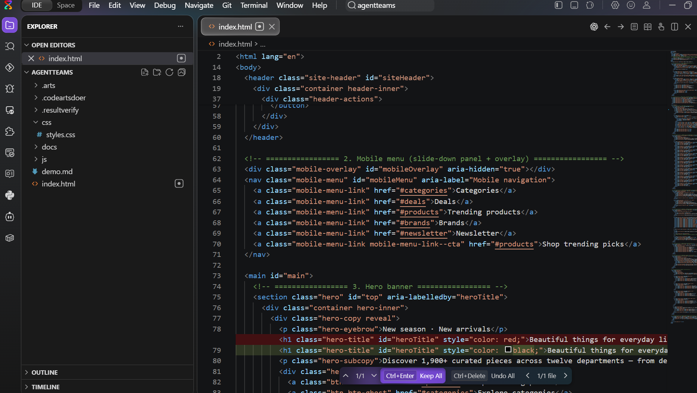
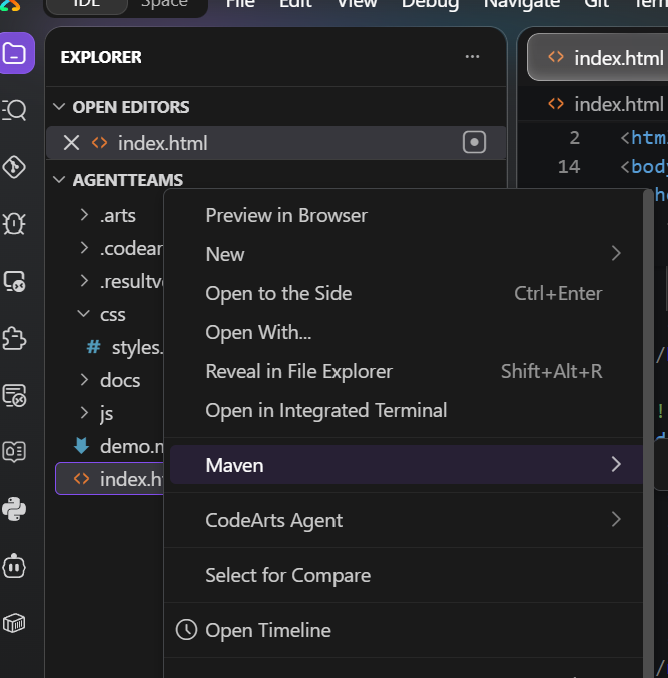
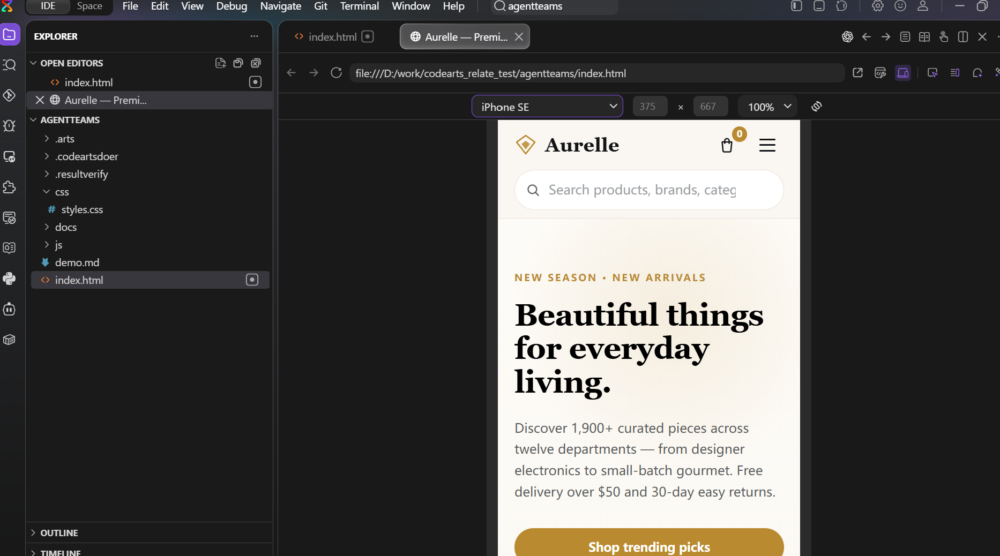
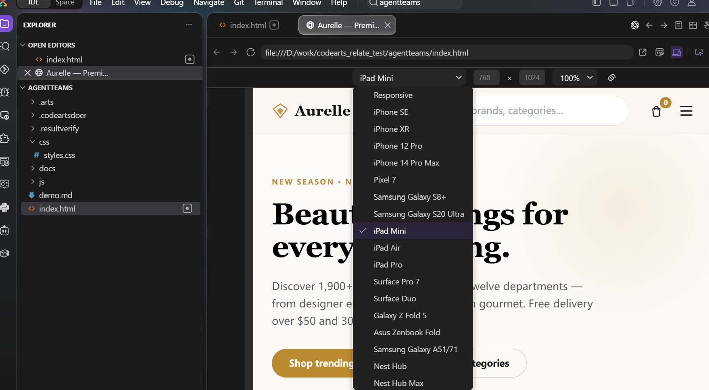
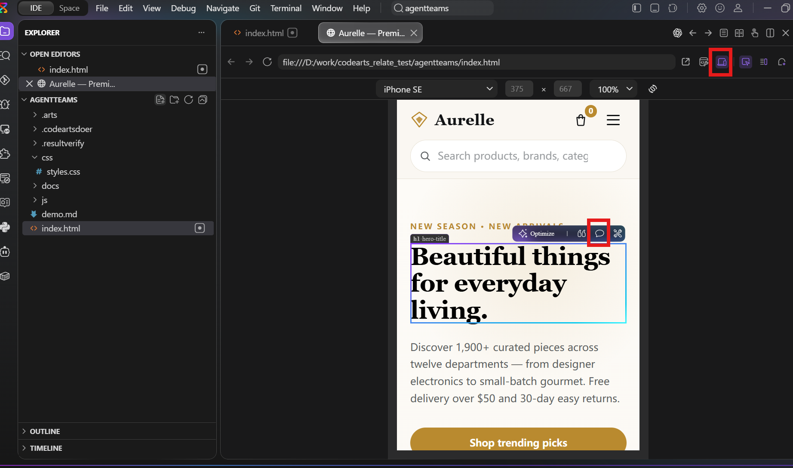
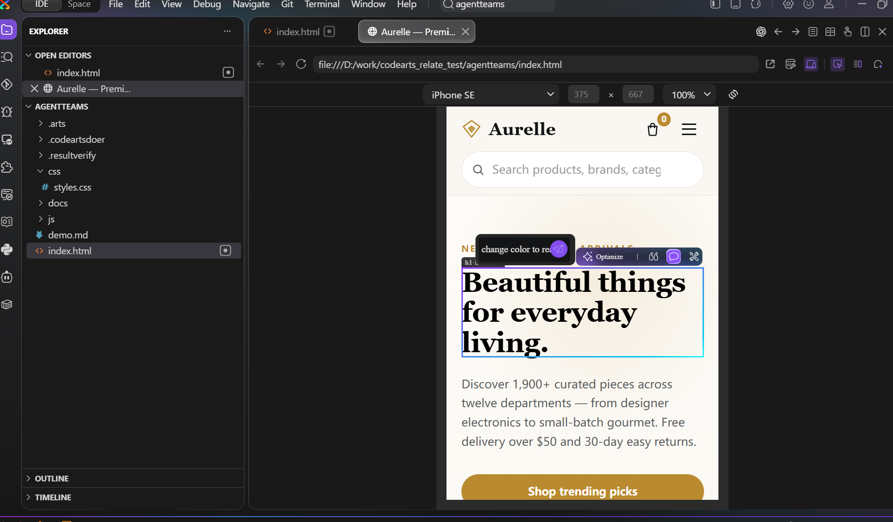
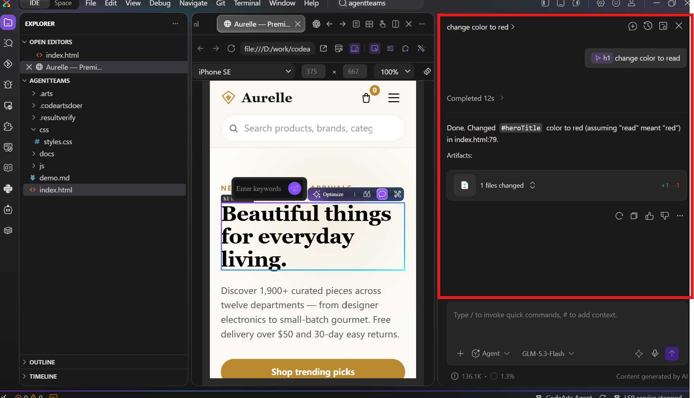
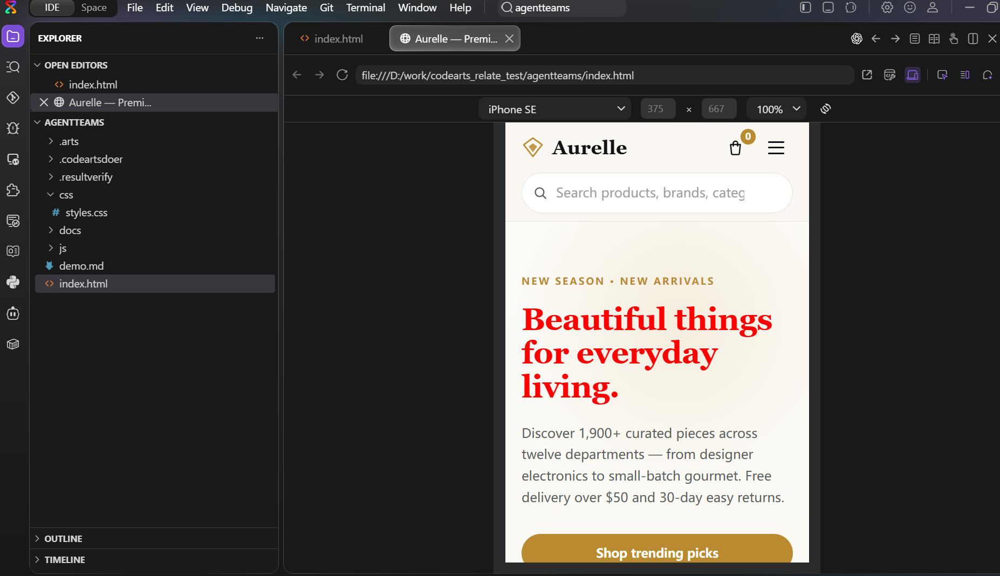

# Frontend Development with CodeArts Agent: Preview a Page and Edit Styles in Natural Language

> Language: **English** ｜ [简体中文](frontend-dev.zh-CN.md)
>
> Video (1 min 10 s, 1152×720, ~7 MB, click to download):
> [frontend-demo.mp4](https://github.com/hhuang37/codearts-agent-demos/releases/download/v0.7.0/frontend-demo.mp4)

## Demo Overview

This demo shows the CodeArts Agent frontend workflow: preview a web page inside the IDE, select an element on it, then describe the change in natural language and let the Agent locate and modify the code. The example changes the color of a page heading.

## 1. Open a Frontend Project

Open a frontend project in CodeArts Agent. If you have already completed the Agent Team demo, you already have an e-commerce frontend project; this demo uses it directly:



## 2. Preview the Page

Right-click `index.html` and choose **Preview in Browser** to open the page preview inside the IDE:





## 3. Switch Preview Devices

Use the toolbar at the top of the preview window to switch devices and check how the page looks at different screen sizes:



## 4. Select an Element and Edit It in Natural Language

Click **Select Element** in the toolbar, then click the element you want to change on the previewed page:



An input box appears next to the selected element. Type a prompt describing the change, for example turning the heading red:

```text
change color to red
```



Press Enter to submit. The Agent's progress appears in the sidebar on the right; it locates the code behind the element (`#heroTitle` in this example) and applies the change:



## 5. Preview Again to Verify

Repeat step 2 (right-click `index.html` > **Preview in Browser**) and check the result:



The heading is now red. The same flow — preview the page, select an element, describe the change in natural language — covers everyday frontend development.
