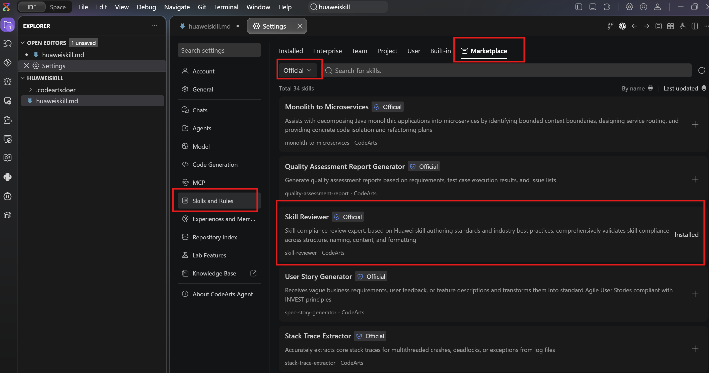
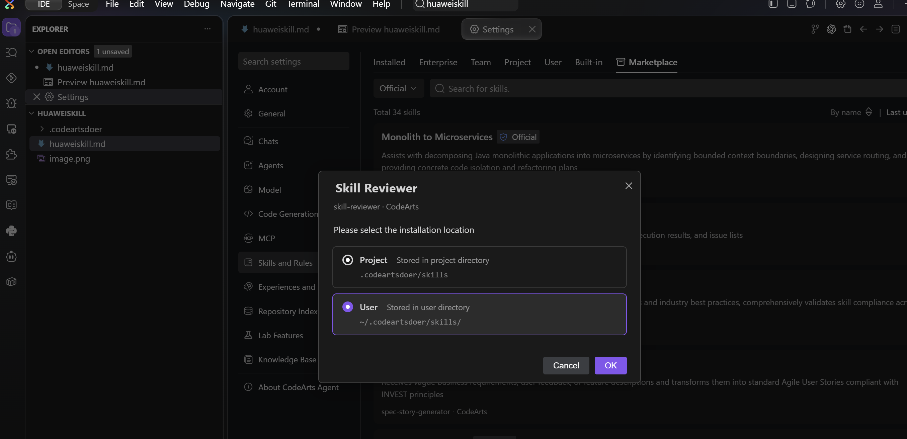
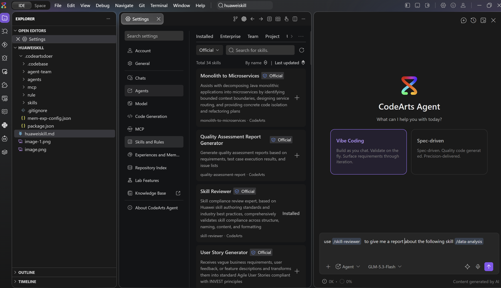
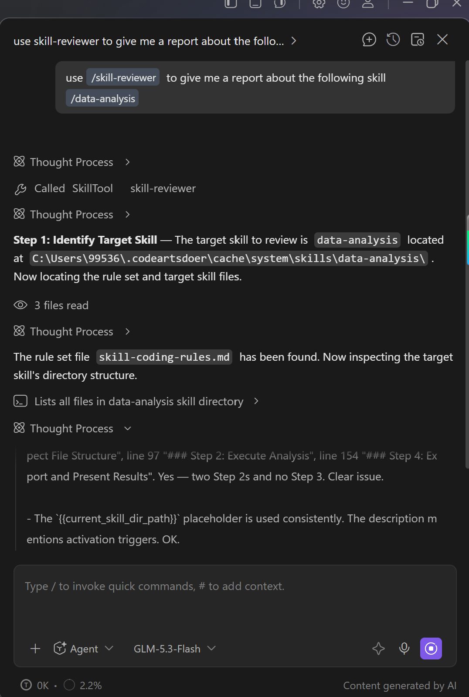
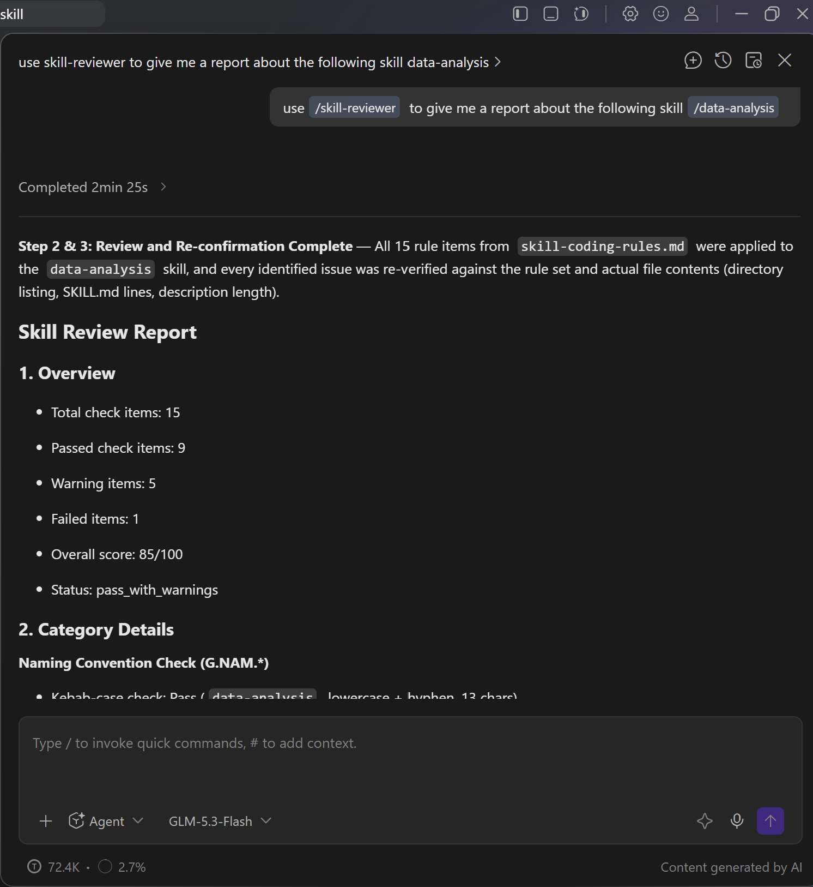

# 在 CodeArts 中安装并验证官方 Skill

> 语言：**中文** ｜ [English](huaweiskill.md)
>
> 视频版（2 分 33 秒，1152×720，约 21 MB，点击为下载）：
> [huaweiskill_demo.mp4](https://github.com/hhuang37/codearts-agent-demos/releases/download/v0.6.0/huaweiskill_demo.mp4)

## 这个 Demo 要展示什么

本文以官方 **Skill Reviewer** 为例，演示如何从 CodeArts Skill 市场安装 Skill，并通过调用它检查另一个 Skill，确认安装和调用流程正常。

## 1. 在官方市场查找 Skill

打开 CodeArts Agent 设置，进入 **Skills and Rules > Marketplace**，将来源筛选为 **Official**，然后找到要安装的 Skill。下图以 `skill-reviewer` 为例，截图显示该 Skill 已安装。



## 2. 安装并选择生效范围

点击目标 Skill 右侧的 **+**，选择安装范围后确认：

- **Project**：安装到当前项目的 `.codeartsdoer/skills` 目录。
- **User**：安装到用户目录 `~/.codeartsdoer/skills/`，供该用户使用。

下图演示选择 **User** 范围并确认安装。



## 3. 调用 Skill

安装后，在 CodeArts Agent 对话中调用 `skill-reviewer`，让它检查 `data-analysis`：

```text
use /skill-reviewer to give me a report about the following skill /data-analysis
```

提交示例提示词：



执行过程中，CodeArts Agent 调用了 `skill-reviewer` 并开始检查目标 Skill：



## 4. 查看审查结果

本次审查共检查 15 项：9 项通过、5 项警告、1 项未通过，综合得分为 **85/100**，报告状态为 `pass_with_warnings`。这表明 `skill-reviewer` 已成功响应并生成审查报告。


