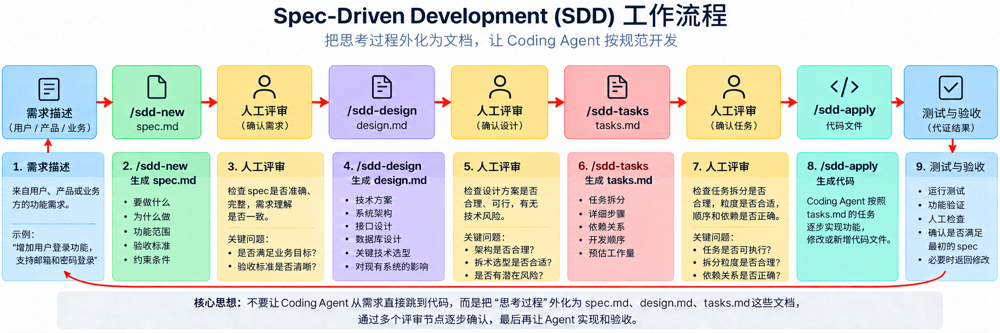

# From Vibe Coding to SDD: Making AI-Assisted Coding More Predictable

When you hear *agentic coding*, you might think of *vibe coding*. Let’s compare the two and see how spec-driven development brings engineering back into the process—and helps produce more reliable results.

Vibe coding gives you quick results. You describe what you want in a prompt, such as “Create me a button,” and hope for the best. Then you look at the result: “That’s a big button. It’s kind of close, but a few important things are off.” You point out the problems to the coding agent, it tries again, and the cycle continues until you’re satisfied. Before long, you have a long dialogue with the agent—and that conversation history may not be saved. This approach works well enough for a button, but it does not scale to a large, ongoing project. High-level prompts are fast, but they can lead to disposable code and mounting technical debt.

> **A note from the author:** Vibe coding is like making a wish to Aladdin’s genie. You might get a fortune right away, but you could also lose ten years of your life. LOL.

We need an engineering approach: a well-maintained specification that guides the coding agent and remains as a lasting project artifact. Spec-driven development (SDD) is a professional response to the chaos of unsupervised AI generation. It separates the specification—which explains *what* to build and *why*—from the implementation, which describes *how* to build it. A spec creates a shared contract among people and with the agent. Your main task as a human shifts to turning your intentions into clear specifications.

With a shared spec, developers can align on the approach and use a common vocabulary. Different coding agents and different large language models can also work from the same expectations. This is especially useful in larger projects, where multiple people, agents, models, and conversations may all contribute to the work.

> **A note from the author:** As the saying goes, a good horse needs a good saddle. The LLM is the horse, and the coding agent is the saddle. In everyday development, different people may use different coding agents, backed by different LLMs and working across different conversations. SDD helps align the work and establish a shared vocabulary—both are essential for large projects.

## From Vibe Coding to SDD

## Three Main Benefits of SDD

Spec-driven development has three main benefits:

1. **Control large code changes with small spec changes.** A few sentences describing an app’s requirements and look and feel can translate into hundreds of lines of code. This spec-driven approach reduces the cognitive overhead of working with ultra-fast coding agents.

2. **Keep context from decaying across agent sessions.** As you work with a coding agent, its context window fills up, often leading to more mistakes as it tries to cope with a full working memory. Specs persist across sessions and even across agents, anchoring the agent to the core context it needs to work in the codebase and implement a feature.

3. **Improve how faithfully the implementation reflects your intent.** Specs make it more likely that an agent will produce code that matches your goals because they require you to define the problem, success criteria, constraints, user flows, and more before code generation begins. A specification is a key difference between vibe coding—improvising as you go—and engineering a viable software product.

Whether you are starting a project from scratch or introducing SDD into a project that has been running for years, specs can help prevent drift and improve productivity. Think of a compiler: it converts human-readable source code into machine code. SDD guides a coding agent, using prompts, to turn a specification into source code. And unlike a programming language designed for a compiler, a spec is written in natural language, so people can read and understand it directly.



---

# Build a Front-End Demo with Huawei CodeArts Agent’s SDD Features

The goal of this demo is not to learn programming. It is to experience how CodeArts turns a business request from a customer into a spec, design, tasks, and a working page that you can review.

## Round One: Generate the Initial Artifacts in CodeArts

Create a simple project, for example, `Customer_Service_Demo`. Open it in CodeArts Agent, open the right sidebar, and select SDD development.


### `/sdd-new`: Clarify the Request First

Start the skill with `/sdd-new`, then send the following English prompt to CodeArts Agent:

```text
Create a customer service ticket registration page.

Business requirements:
- Customer name and problem description are required.
- The problem level is required and must be one of these exact labels: "General", "Important", or "Urgent".
- When the problem level is "Urgent", the impact scope is required.
- After a successful submission, show the status as "Pending Analysis". Never show the status as "Resolved".

Scope and constraints:
- This is a static HTML page that can be opened directly in a browser.
- Do not use a backend, database, login, message queue, or third-party framework.
- Write all generated project documents and all user-facing page text in English.

Write clear scope boundaries and verifiable acceptance criteria in spec.md. Do not implement the page yet.
```


After `spec.md` is generated, it is usually located at `.codeartsdoer/specs/<artifact-folder>/spec.md` in the project root. Review it and check:

1. Are all four business rules included?
2. Does it clearly state what is out of scope?
3. Can each rule be verified by interacting with the page?


### `/sdd-design`: Decide How the Page Will Meet the Requirements

Start the skill with `/sdd-design`, then send the following English prompt to CodeArts Agent:

```text
Based on the current spec.md, create an incremental design for a single-file static HTML page.

The page should include a ticket form, a problem-level selector with the exact options "General", "Important", and "Urgent", an impact-scope field that is required for urgent tickets, and a submission-result area. On successful submission, show the status as "Pending Analysis". Do not show "Resolved". Do not add a backend or external service.

Write all generated project documents and all user-facing page text in English. Explain where each acceptance criterion appears or is handled in the page. Do not implement the page yet.
```


After `design.md` is generated, check whether all four rules are addressed visibly and whether any unnecessary database or service deployment has been introduced.


### `/sdd-tasks`: Make Sure the Development Tasks Are Clear

Start the skill with `/sdd-tasks`, then send the following English prompt to CodeArts Agent:

```text
Based on the current spec.md and design.md, update tasks.md with beginner-friendly implementation and manual verification tasks.

Cover the page structure, the four business rules, submission feedback, and browser checks for both successful and rejected submissions. For every task, provide a clear completion criterion. Do not add backend, database, or deployment work.

Write tasks.md and all task descriptions in English. Preserve any existing completed tasks. Do not implement the tasks yet.
```


After `tasks.md` is generated, try to restate each item in business language. If you need many technical terms to explain a task, it may be worth simplifying it further.


### `/sdd-apply`: Implement and Review the Result

Start the skill with `/sdd-apply`, then send the following English prompt to CodeArts Agent:

```text
Implement the current tasks.md using the latest spec.md and design.md.

Create or update one static HTML file named ticket_register.html that can be opened directly in a browser. Do not add installation steps, a backend, a database, or third-party dependencies. Keep all user-facing page text in English.

After implementation, explain in English which file was created or updated and how to verify the four business rules in a browser.
```


When implementation is complete, open the generated HTML file and check:

1. Can a valid ticket be submitted?
2. Does submission fail if a required field, such as the problem description, is empty?
3. When the problem level is urgent, does submission fail if the impact scope is empty?


## Round Two: Add a Unique Ticket Number

Now suppose the customer has a new request:

> After a ticket is submitted successfully, generate a ticket number and display it on the page so the customer can follow up later.

Do not create a new project or rewrite all the original requirements. Continue using the existing artifact folder:

```text
.codeartsdoer/specs/ticket_register/
```

First, confirm the scope of this change:

| Question | Analysis of the new requirement |
|---|---|
| Scope: What should the ticket number do? | Display it on the page only; do not persist it in a backend. |
| Decisions: How should it be generated? | Use a simple sequential number within the page session, such as `TK-0001`. |
| Context: Which existing behavior must be preserved? | Keep the original four rules and the “Pending Analysis” status. |

### Update the Existing `spec.md`

Do not create a new project. In CodeArts Agent, start the skill with `/sdd-new` and send the following English prompt:

```text
We are continuing the existing ticket_register project with an incremental requirement.

Do not create a new project, remove the existing requirements, or introduce Java, Python, a backend, a database, or third-party frameworks.

New requirement:
After a ticket is submitted successfully, generate a ticket number and display it in the submission-result area so the customer can follow up later.

Scope and acceptance criteria:
1. Generate ticket numbers only within the current page session.
2. Two consecutive successful submissions must receive different ticket numbers.
3. A rejected submission must not generate a ticket number.
4. Preserve the existing customer-name, problem-description, problem-level, urgent-impact-scope, and "Pending Analysis" requirements.
5. Do not persist ticket data in a database. Ticket numbers do not need to survive a page refresh.

First update the existing spec.md only. Do not modify the HTML yet.
Write spec.md and all generated project documents in English. Then summarize in English what changed, which sections were updated, and what is out of scope.
```


After the update, check only these three things: a successful submission displays a number, a rejected submission does not generate one, and the original four rules are still present. In this hands-on example, the new requirement was added as a new section in `spec.md`.

### Update `design.md`

Run:

```text
/sdd-design
```

Then send the following English prompt:

```text
Based on the latest spec.md for the existing ticket_register feature, update design.md incrementally.

Design only the new ticket-number behavior:
- Generate sequential ticket numbers within the current page session.
- Display the number in the successful submission-result area.
- Do not generate a number when submission is rejected.
- Do not add a database, backend service, login, or external API.
- Preserve the existing form validation and the "Pending Analysis" status.

Write design.md and all generated project documents in English. Do not rewrite sections unrelated to this change, and do not modify the HTML yet.
```


Check where the number appears, when it is generated, and whether it is skipped when submission fails.

### Update `tasks.md`

Run:

```text
/sdd-tasks
```

Then send the following English prompt:

```text
Based on the latest spec.md and design.md, update the existing tasks.md incrementally.

Add only these tasks:
1. Generate sequential ticket numbers within the current page session.
2. Display the ticket number in the successful result area.
3. Verify that consecutive successful submissions receive different numbers.
4. Verify that a rejected submission does not generate a number.
5. Regression-test the original four business rules.

Write tasks.md and all task descriptions in English. Preserve completed tasks. Do not add backend, database, or deployment tasks. Do not implement the tasks yet.
```


Check where the new requirement appears in `tasks.md`.

### Update `ticket_register.html`

Run:

```text
/sdd-apply
```

Then send the following English prompt:

```text
Incrementally update the existing ticket_register.html according to the latest spec.md, design.md, and tasks.md.

Requirements:
- Keep the deliverable as a single static HTML file.
- Do not add installation steps, a backend, or a database.
- Add ticket-number generation and display.
- Preserve all existing validation rules and the "Pending Analysis" status.
- Keep all user-facing page text in English.

After implementation, explain in English how to verify the new requirement and regression-test the existing requirements.
```


Wait for implementation to finish.

### Verify in Order

Open the latest `ticket_register.html`:

1. When the page first opens, no ticket number is displayed.
2. Fill in and submit a valid ticket. Confirm that `TK-0001` and “Pending Analysis” appear.
3. Submit another valid ticket. Confirm that it receives a different number, such as `TK-0002`.
4. Select “Urgent” but leave the impact scope empty. Submission should fail, no new number should be generated, and the previous number should remain unchanged.
5. Regression-test the customer name, problem description, problem level, and urgent impact-scope rules.
6. Confirm that the form clears after a successful submission and the page never shows “Resolved.”


