# 从 vibe coding 到 SDD：让智能编程更可控

当我们提到智能编程（agentic coding），很多人首先想到的可能是 vibe coding。本文将对比 vibe coding 和 SDD（spec driven developments），看看 SDD 如何通过引入工程化方法，让编程结果更可控。

vibe coding 能快速给我们结果，你可能通过写一个prompt来描述你想做一个什么功能， 比如： 给我做一个前端界面按钮。 但是有的时候你觉得这个按钮太大了， 颜色不是我想要的...  然后你给 coding agent指出它的问题，让它更改，直到你对最后的结果满意为止。 这时你会发现，你跟coding agent做了一个很长的多轮对话， 对话的历史没有被保留。  这样的开发方式对一个按钮来说是够用的。 但是在面对大型企业级大的开发工程来说是不够的。

> **作者感受：** vibe coding就像给阿拉丁神灯许愿，可能你能马上得到一笔财富，但是有可能你会折寿10年，LOL .

所以我们需要工程化的方式， 用一个维护好的规范（specification）来指导coding agent进行开发。 SDD （Spec-driven developments） 就是这样一个开发的方法论，它会把这个项目要做什么（what），为什么这么做（why） 写进spec规范中，并把如何做（how）写进design, task设计文档中， 实现解耦。  有了这个规范，我们不仅在开发人员之间对齐开发思路，约定共同语言。 同时不同的 coding agent之间， 不同的 LLM 之间也能够同样做到。 现在我们就有了一个有力的"方法论"，可以将我们的意图转化为清晰的开发规范。

> **作者感受:** 常言道好马配好鞍， LLM是马， coding agent是鞍。 在常见的代码开发场景下，我们有不同的人 -> 用不同Coding Agent（鞍） -> 使用不同的LLM（马） -> 在不同的对话 来完成我们的开发任务。 因此，使用SDD开发方式，对齐开发思路，约定共同语言是大型项目开发的必备。

## 从 vibe coding 到 SDD

## SDD 的三个主要收益

使用 SDD 开发有三个主要收益：

1. 首先，你能够通过对规范（spec）的小幅度修改来控制大规模的代码更改，规范中几句需求描述的话，就会转化成数百行的代码。 这种"规范驱动" 的方法能够降低coding agent之间协作所需要的认知负担。

2. 其次规范（spec）能够消减coding agent开发中，因为多轮对话造成上下文衰减的问题。 当你与coding agent协作时，它的上下文窗口会逐渐被填满，上下文窗口的增加，往往会导致更多的幻觉，更多的错误。规范可以在会话之间、甚至在不同智能体之间持久保存，将智能体框定在代码库中遵循规范工作，让coding agent能更专注工程原始功能的开发。

3. 第三，规范（spec）提升了你的意图保真度（intention fidelity），也就是说，coding agent更有可能生成与你的目标相匹配的代码。这是因为规范迫使你在智能体开始生成代码之前，就明确定义问题、成功标准、约束条件、用户流程等。规范(specification)是"氛围编程（vibe coding）"（随性凑合）与工程化打造一个可行软件产品之间的关键区别。

无论你是从零开始一个新项目，还是想将SDD（规范驱动开发）方法引入一个已经运行多年的项目，规范（spec）都有助于解决偏离和生产力问题。打个比方，想想编译器(compiler)——它将可理解的源代码转换为机器码。SDD则引导智能体(coding agent)和提示词（prompt），将规范转换为源代码。 更妙的是，相比编译器（compiler）语言,规范(spec)就是人类通过自然语言编写的，天然就能够被人类理解!

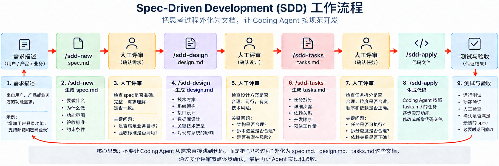

---

# 如何使用华为CodeArts Agent的SDD开发功能进行一个前端demo开发

这个 Demo 的目标不是学编程，而是亲自体验一次：客户说一句业务需求，CodeArts 如何把它变成可确认的规格、设计、任务和页面。

## 第一轮：在 CodeArts 中生成第一轮产物

新建一个简单项目，例如 `Customer_Service_Demo`。用CodeArts Agent打开该项目，打开右侧边栏，选择SDD开发。

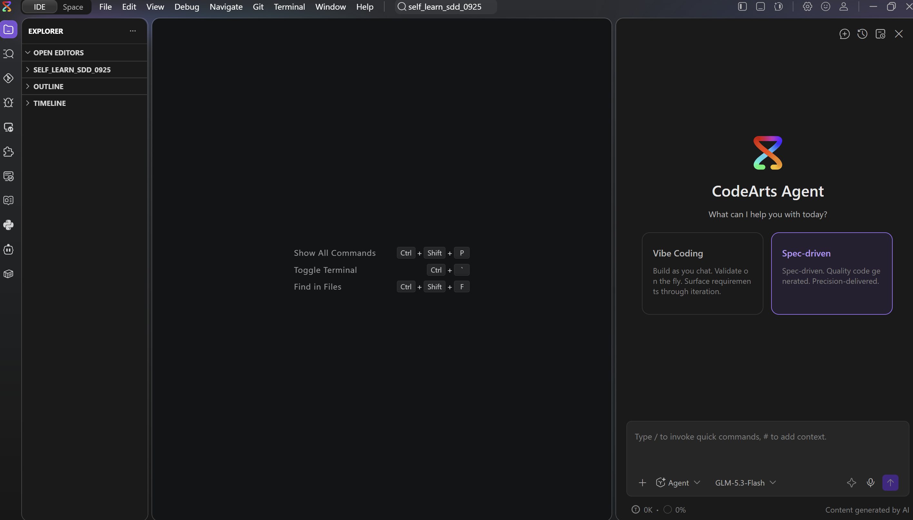

### `/sdd-new`：先把口头需求说清楚

使用/sdd-new 启动skill 把下面的英文 Prompt 发送给 CodeArts Agent：

```text
Create a customer service ticket registration page.

Business requirements:
- Customer name and problem description are required.
- The problem level is required and must be one of these exact labels: "General", "Important", or "Urgent".
- When the problem level is "Urgent", the impact scope is required.
- After a successful submission, show the status as "Pending Analysis". Never show the status as "Resolved".

Scope and constraints:
- This is a static HTML page that can be opened directly in a browser.
- Do not use a backend, database, login, message queue, or third-party framework.
- Write all generated project documents and all user-facing page text in English.

Write clear scope boundaries and verifiable acceptance criteria in spec.md. Do not implement the page yet.
```

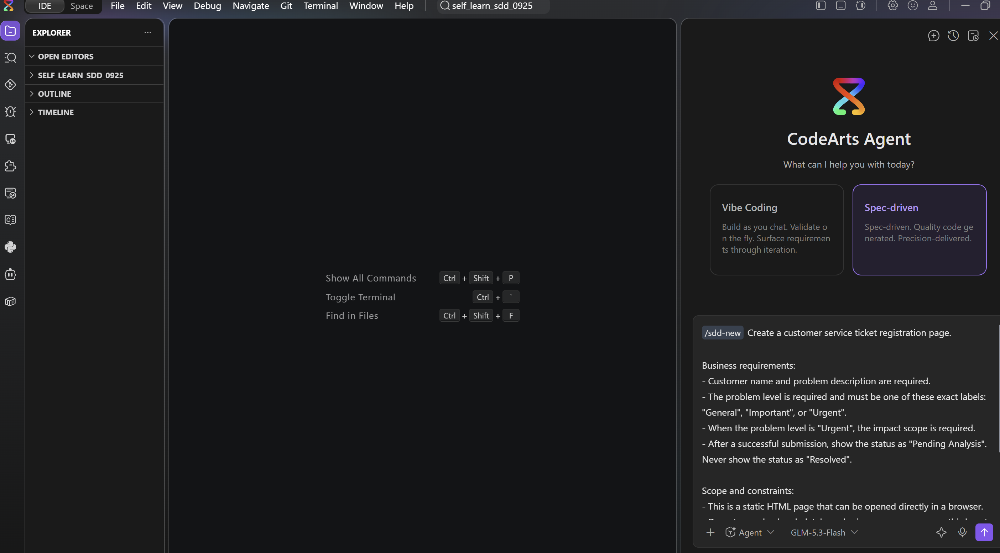

得到 `spec.md` 后，产物通常位于项目根目录的 `.codeartsdoer/specs/<产物文件夹>/spec.md`。阅读spec.md 做如下内容检查：

1. 四条业务规则有没有漏掉？
2. 有没有写出本次不做的事情？
3. 每条规则能不能通过页面操作判断对错？

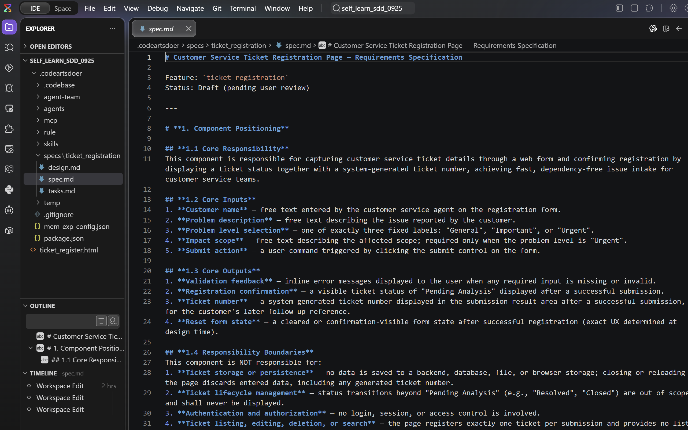

### `/sdd-design`：确认页面怎么承接需求

使用/sdd-design 启动skill 把下面的英文 Prompt 发送给 CodeArts Agent：

```text
Based on the current spec.md, create an incremental design for a single-file static HTML page.

The page should include a ticket form, a problem-level selector with the exact options "General", "Important", and "Urgent", an impact-scope field that is required for urgent tickets, and a submission-result area. On successful submission, show the status as "Pending Analysis". Do not show "Resolved". Do not add a backend or external service.

Write all generated project documents and all user-facing page text in English. Explain where each acceptance criterion appears or is handled in the page. Do not implement the page yet.
```

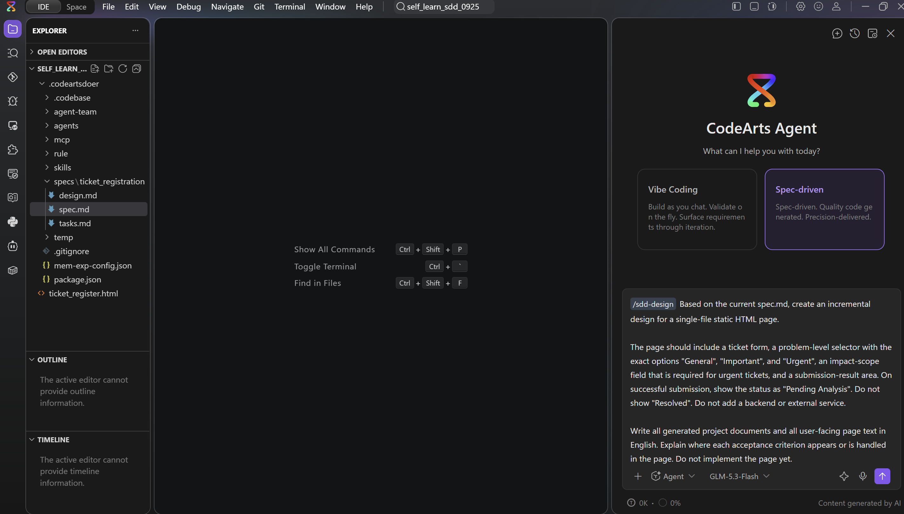

得到 `design.md` 后，检查：四条规则是否都有可见承接，是否出现了不必要的数据库或服务部署。

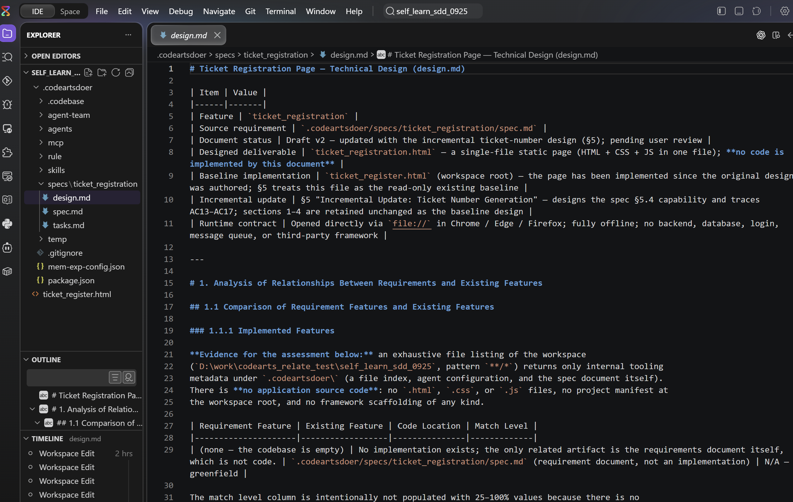


### `/sdd-tasks`：确认开发任务是否写清楚


使用/sdd-tasks 启动skill 把下面的英文 Prompt 发送给 CodeArts Agent：

```text
Based on the current spec.md and design.md, update tasks.md with beginner-friendly implementation and manual verification tasks.

Cover the page structure, the four business rules, submission feedback, and browser checks for both successful and rejected submissions. For every task, provide a clear completion criterion. Do not add backend, database, or deployment work.

Write tasks.md and all task descriptions in English. Preserve any existing completed tasks. Do not implement the tasks yet.
```

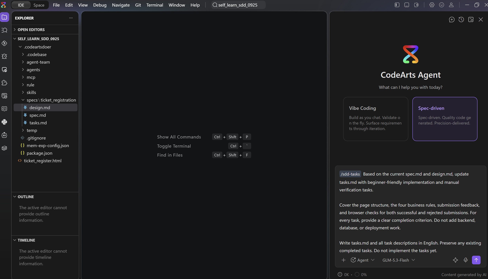


得到 `tasks.md` 后，尝试用业务语言复述每一项。如果只能用很多技术术语描述，说明任务还可以继续简化。

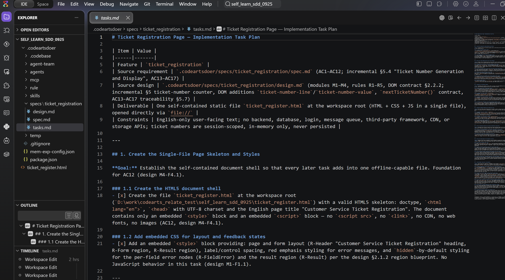

### `/sdd-apply`：执行并展示结果

使用/sdd-apply 启动skill 把下面的英文 Prompt 发送给 CodeArts Agent：

```text
Implement the current tasks.md using the latest spec.md and design.md.

Create or update one static HTML file named ticket_register.html that can be opened directly in a browser. Do not add installation steps, a backend, a database, or third-party dependencies. Keep all user-facing page text in English.

After implementation, explain in English which file was created or updated and how to verify the four business rules in a browser.
```

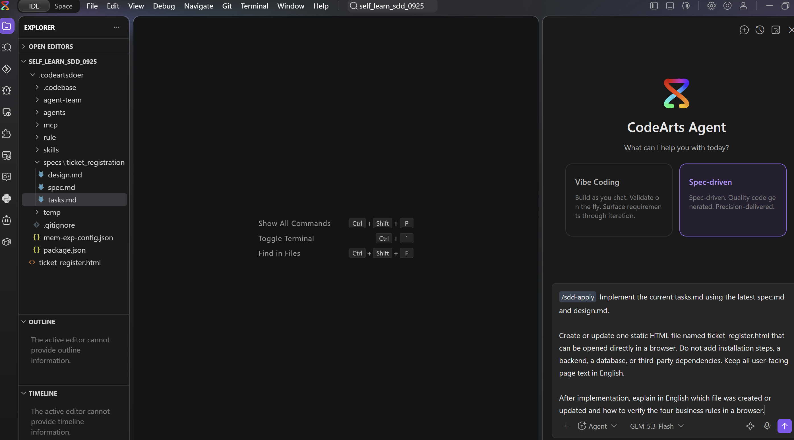

执行完成后，打开生成的 HTML， 确认：
1. 正常问题能不能录入？
2. 如果不填必填项（比如问题描述），表单提交是否会失败？
3. 如果问题级别是urgent， 不填影响范围是不是会影响表单提交？

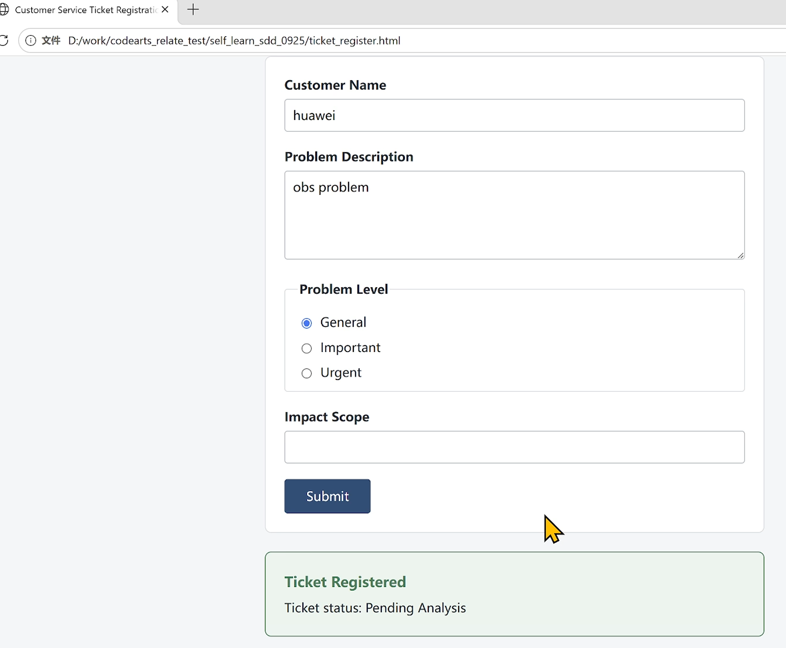

## 第二轮：再加一个需求：问题录入时加入唯一的工单编号

现在假设客户提出新需求：

> After a ticket is submitted successfully, generate a ticket number and display it on the page so the customer can follow up later.

不要重新新建项目，也不要把原来的需求全部重写。继续使用原来的产物文件夹：

```text
.codeartsdoer/specs/ticket_register/
```

先确认本次变化的范围：

| 问题 | 新增需求的分析 |
|---|---|
| Scope：编号要做到什么程度？ | 只在页面显示，不做后台持久化 |
| Decisions：编号如何生成？ | 使用页面会话内递增的简单编号，例如 `TK-0001` |
| Context：哪些行为不能被影响？ | 原来的四条规则和“待分析”状态保持不变 |

### 更新现有 `spec.md`

不要再创建新的project。在 CodeArts Agent 中 /sdd-new 启动skill, 发送下面的英文 Prompt：

```text
We are continuing the existing ticket_register project with an incremental requirement.

Do not create a new project, remove the existing requirements, or introduce Java, Python, a backend, a database, or third-party frameworks.

New requirement:
After a ticket is submitted successfully, generate a ticket number and display it in the submission-result area so the customer can follow up later.

Scope and acceptance criteria:
1. Generate ticket numbers only within the current page session.
2. Two consecutive successful submissions must receive different ticket numbers.
3. A rejected submission must not generate a ticket number.
4. Preserve the existing customer-name, problem-description, problem-level, urgent-impact-scope, and "Pending Analysis" requirements.
5. Do not persist ticket data in a database. Ticket numbers do not need to survive a page refresh.

First update the existing spec.md only. Do not modify the HTML yet.
Write spec.md and all generated project documents in English. Then summarize in English what changed, which sections were updated, and what is out of scope.
```

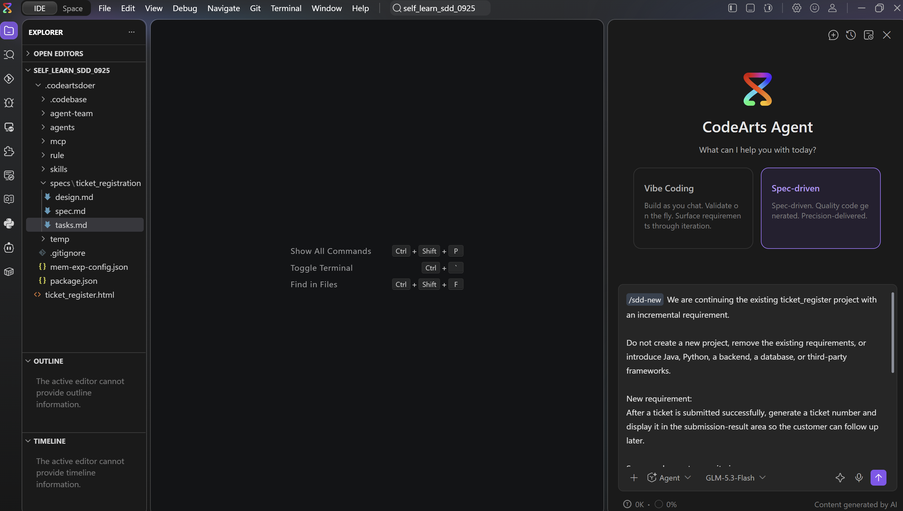

更新后只检查三件事：成功是否显示编号、失败是否不生成编号、原来的四条规则是否还在。本次实操结果把新增需求放在 `spec.md` 的新章节。

### 更新 `design.md`

执行：

```text
/sdd-design
```

然后发送下面的英文 Prompt：

```text
Based on the latest spec.md for the existing ticket_register feature, update design.md incrementally.

Design only the new ticket-number behavior:
- Generate sequential ticket numbers within the current page session.
- Display the number in the successful submission-result area.
- Do not generate a number when submission is rejected.
- Do not add a database, backend service, login, or external API.
- Preserve the existing form validation and the "Pending Analysis" status.

Write design.md and all generated project documents in English. Do not rewrite sections unrelated to this change, and do not modify the HTML yet.
```

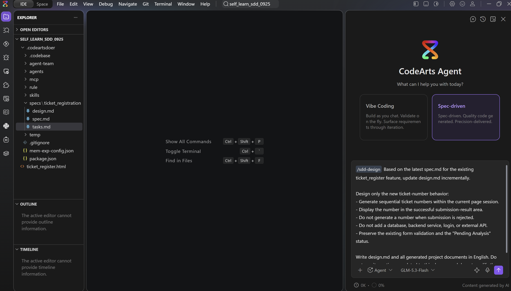

检查结果：编号显示在哪里、什么时候生成、失败时是否不生成。

### 更新 `tasks.md`

执行：

```text
/sdd-tasks
```

然后发送下面的英文 Prompt：

```text
Based on the latest spec.md and design.md, update the existing tasks.md incrementally.

Add only these tasks:
1. Generate sequential ticket numbers within the current page session.
2. Display the ticket number in the successful result area.
3. Verify that consecutive successful submissions receive different numbers.
4. Verify that a rejected submission does not generate a number.
5. Regression-test the original four business rules.

Write tasks.md and all task descriptions in English. Preserve completed tasks. Do not add backend, database, or deployment tasks. Do not implement the tasks yet.
```

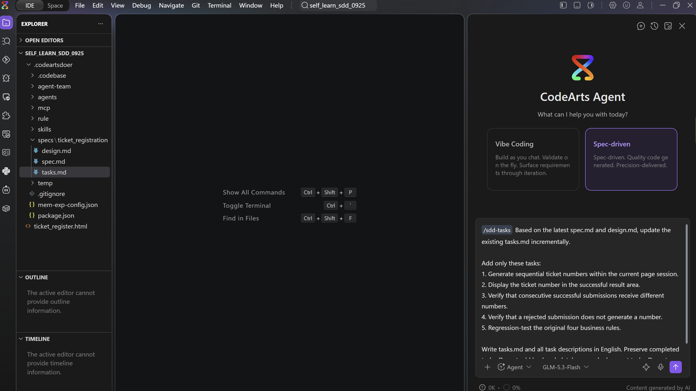

检查结果：在task.md中新增的需求在哪些章节展现。

### 更新 `ticket_register.html`

执行：

```text
/sdd-apply
```

然后发送下面的英文 Prompt：

```text
Incrementally update the existing ticket_register.html according to the latest spec.md, design.md, and tasks.md.

Requirements:
- Keep the deliverable as a single static HTML file.
- Do not add installation steps, a backend, or a database.
- Add ticket-number generation and display.
- Preserve all existing validation rules and the "Pending Analysis" status.
- Keep all user-facing page text in English.

After implementation, explain in English how to verify the new requirement and regression-test the existing requirements.
```

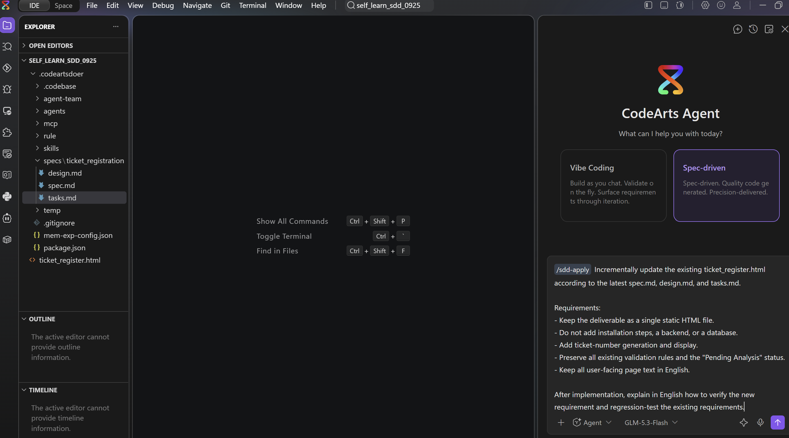

等待开发完成

### 按顺序验证

打开最新的 `ticket_register.html`：

1. 页面刚打开时，不显示工单编号；
2. 填写完整工单并提交，看到 `TK-0001` 和“待分析”；
3. 再提交一张完整工单，看到不同编号，例如 `TK-0002`；
4. 选择“紧急”但不填影响范围，提交失败，不生成新编号，原编号保持不变；
5. 回归客户名称、问题描述、问题等级和紧急影响范围四条规则；
6. 确认成功后表单清空，页面没有“已解决”。

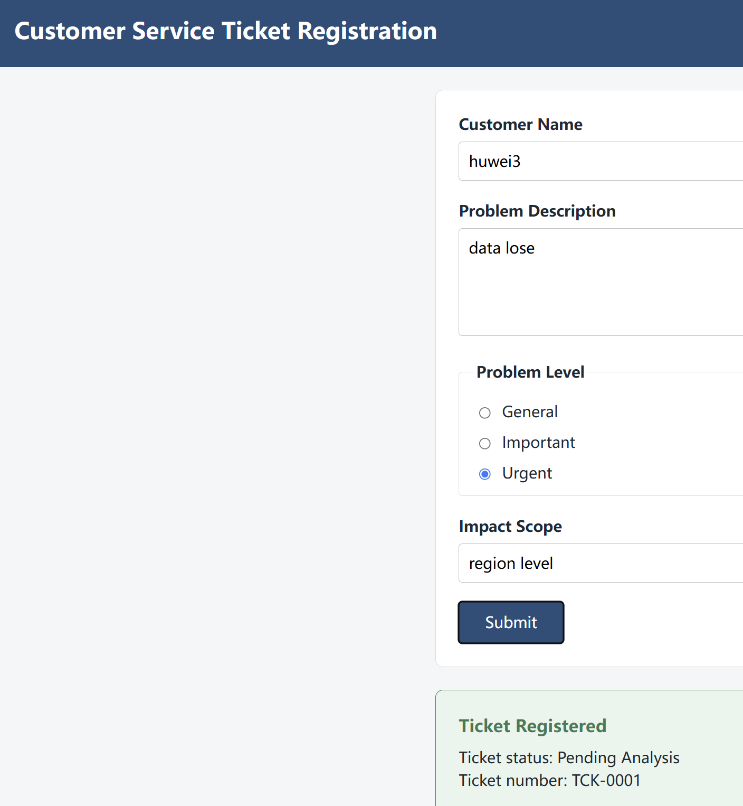
