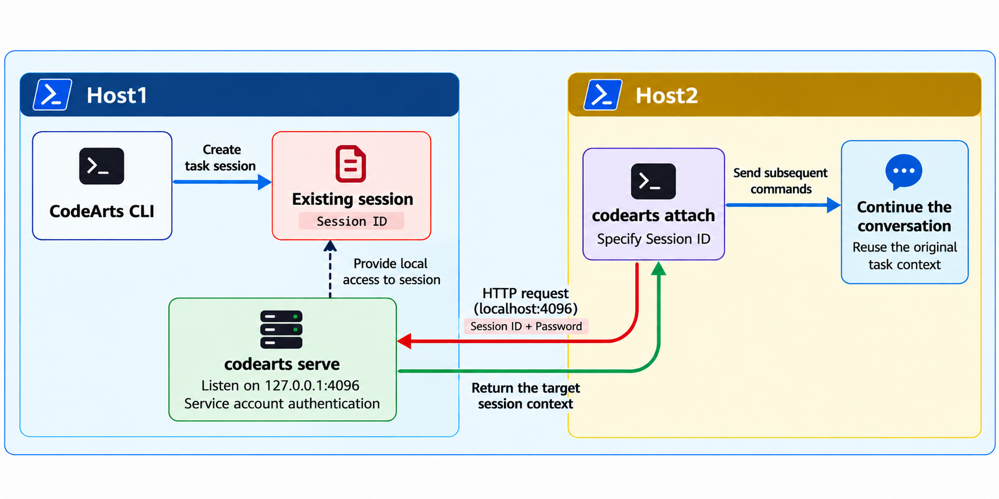
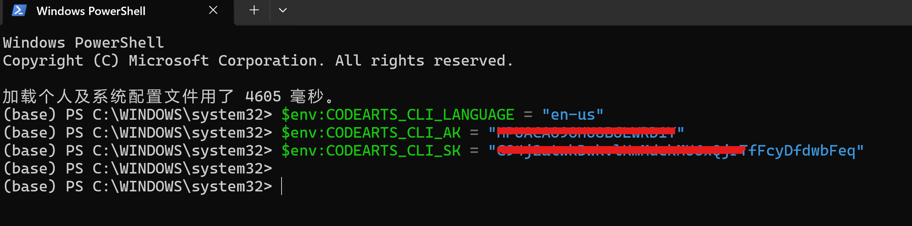
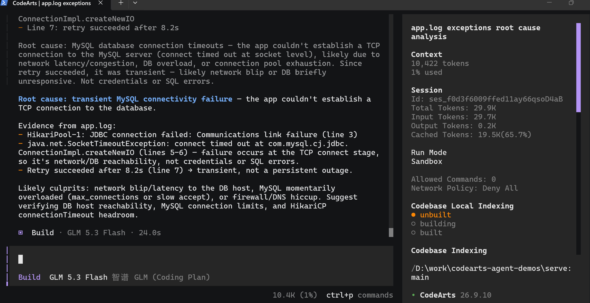
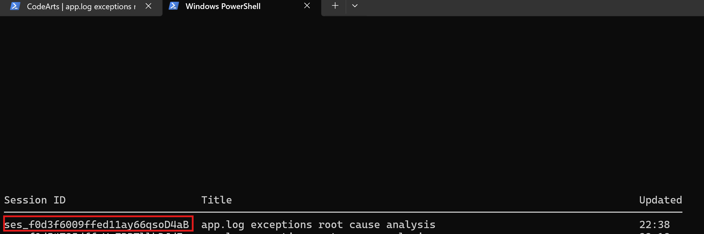
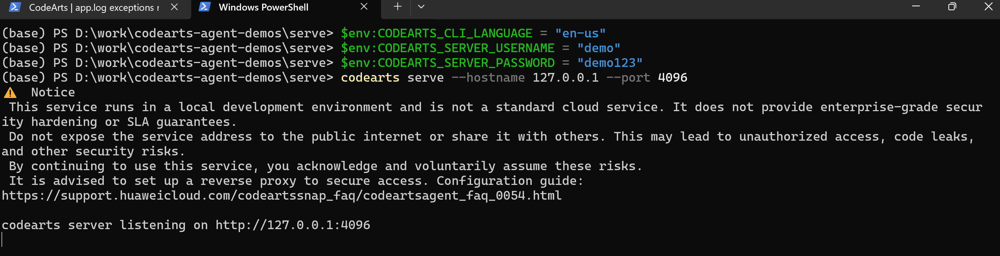
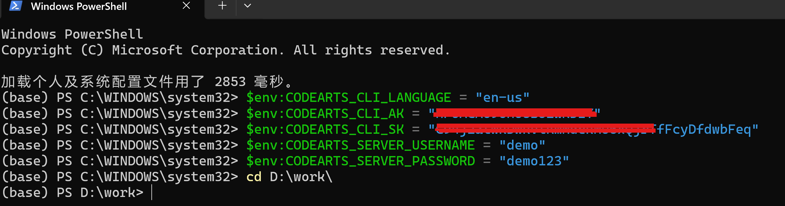
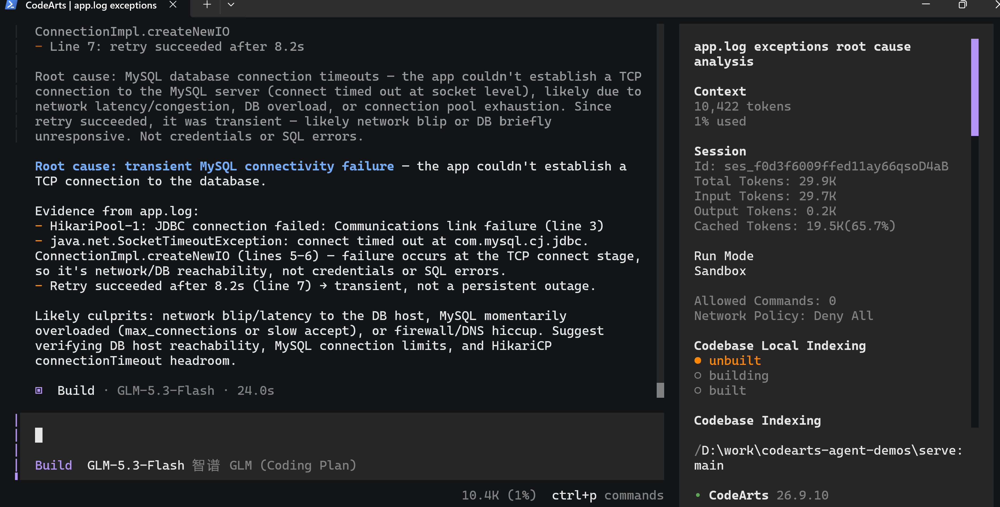
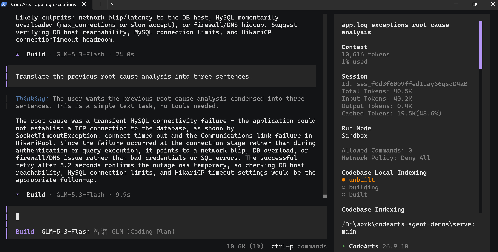

# CodeArts CLI `serve` / `attach`: Remote Development Demo

> Language: **English** ｜ [简体中文](cli_serve_attach.zh-CN.md)
>
> Video (3 min 52 s, 1152×720, ~22 MB, click to download):
> [cli_serve_demo.mp4](https://github.com/hhuang37/codearts-agent-demos/releases/download/v0.5.0/cli_serve_demo.mp4)

## What This Demo Shows

Host 1 runs CodeArts CLI from the project directory to create a task session, then starts a local listening service with `codearts serve`. Host 2 connects to that service with `codearts attach`, specifies the session ID from Host 1, and continues the conversation with the original session context.



## Host 1: Create a session and start the service

### Step 1: Set the CLI language

In the first PowerShell window, run:

```powershell
$env:CODEARTS_CLI_LANGUAGE = "en-us"
```

### Step 2: Configure your AK/SK

Open the [CodeArts CLI authentication settings page](https://codearts.huaweicloud.com/portal/settings/cli-auth?locale=en-us) to obtain your AK/SK. Then set them in the current PowerShell window:

```powershell
$env:CODEARTS_CLI_AK = "<your AK>"
$env:CODEARTS_CLI_SK = "<your SK>"
```

Replace the placeholders with your own values. Variables set with `$env:` apply only to the current PowerShell window and processes launched from it. Set them again in every new window.



### Step 3: Start CodeArts CLI and analyze the log

In the same PowerShell window, switch to the demo directory and start the CLI:

```powershell
cd D:\work\codearts-agent-demos\serve
codearts
```

The CLI analyzes `app.log` in the demo directory. Download the sample [app.log](./app.log) — a JDBC connect-timeout incident — and save it to that path (`D:\work\codearts-agent-demos\serve\app.log`) before entering the prompt below.

When the interactive CLI opens, enter this prompt:

```text
Analyze the exceptions in app.log to identify the possible root cause.
```

Wait for the analysis to finish. Review the result, then exit the interactive CLI and return to PowerShell.



### Step 4: Find and record the session ID

Run the command from the directory where you created the session:

```powershell
cd D:\work\codearts-agent-demos\serve
codearts session list
```

Find the log-analysis session and copy its `ses_...` session ID. Use this ID with `attach` to select the session you want to resume.

> **Note:** If you run `session list` in a new window, first set the AK/SK required in that window, then switch to the demo directory. If the directory does not match, the target session may not appear.



### Step 5: Start the local server

Continue in the PowerShell window where AK/SK are already set. Set the server account, then start the service:

```powershell
$env:CODEARTS_CLI_LANGUAGE = "en-us"
$env:CODEARTS_SERVER_USERNAME = "demo"
$env:CODEARTS_SERVER_PASSWORD = "demo123"
codearts serve --hostname 127.0.0.1 --port 4096
```

When the server reports that it is listening on `127.0.0.1:4096`, leave this window and the service running until Host 2 has connected.



## Host 2: Resume the session from the following terminal

### Step 6: Configure the second PowerShell window

Open a new PowerShell window on the same computer. Set the CLI language, the same AK/SK as on Host 1, and the server account, then switch to the demo directory:

```powershell
$env:CODEARTS_CLI_LANGUAGE = "en-us"
$env:CODEARTS_CLI_AK = "<the same AK as on Host 1>"
$env:CODEARTS_CLI_SK = "<the same SK as on Host 1>"
$env:CODEARTS_SERVER_USERNAME = "demo"
$env:CODEARTS_SERVER_PASSWORD = "demo123"
cd D:\work\codearts-agent-demos\serve
```

The server username and password must match the values set on Host 1. The `-p` option in `attach` passes the password; the username is read from the `CODEARTS_SERVER_USERNAME` environment variable.



### Step 7: Connect and select the session

Replace `<SESSION_ID>` with the full session ID copied in Step 4:

```powershell
codearts attach http://localhost:4096 -p demo123 -s "<SESSION_ID>"
```



### Step 8: Send a follow-up prompt

After connecting, enter this prompt in the interactive CLI:

```text
Translate the previous root cause analysis into three sentences.
```

Confirm that the reply builds on the earlier root-cause analysis and summarizes it in three sentences.



## End the demo

When the demo is complete, return to the PowerShell window running `serve` on Host 1 and press `Ctrl+C` to stop the service.


