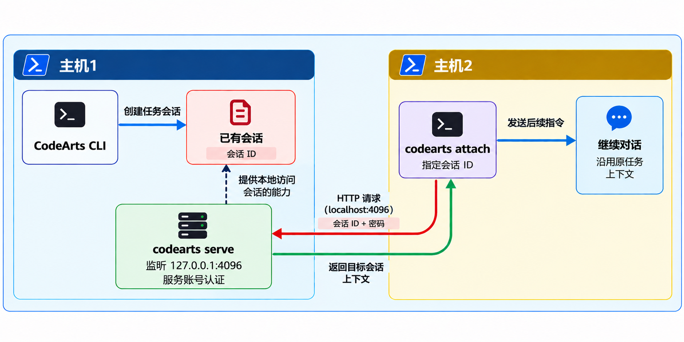

# 码道 CLI `serve` / `attach` 远程开发演示

> 语言：**中文** ｜ [English](cli_serve_attach.en-US.md)
>
> 视频版（3 分 52 秒，1152×720，约 22 MB，点击为下载）：
> [cli_serve_demo.mp4](https://github.com/hhuang37/codearts-agent-demos/releases/download/v0.5.0/cli_serve_demo.mp4)

## 这个 Demo 做什么

主机1在项目目录中运行 CodeArts CLI，创建已有任务会话，再用 `codearts serve` 启动本机监听服务。主机2通过 `codearts attach` 连接该服务，指定主机1的会话 ID，接着沿用原会话上下文继续提问。




## 主机1：创建会话并启动服务

### 步骤 1：设置 CLI 语言

在第一个 PowerShell 窗口中执行：

```powershell
$env:CODEARTS_CLI_LANGUAGE = "en-us"
```

### 步骤 2：配置 AK/SK

打开[码道 CLI 认证设置页](https://codearts.huaweicloud.com/portal/settings/cli-auth?locale=en-us)，准备 AK/SK，然后在当前 PowerShell 窗口中设置：

```powershell
$env:CODEARTS_CLI_AK = "<你的 AK>"
$env:CODEARTS_CLI_SK = "<你的 SK>"
```

将占位符替换为自己的值。`$env:` 设置只对当前 PowerShell 窗口及其启动的程序生效；新开窗口后需要重新设置。


### 步骤 3：启动 CLI 并分析日志

在同一个 PowerShell 窗口中切换到演示目录并启动 CLI：

```powershell
cd D:\work\codearts-agent-demos\serve
codearts
```

CLI 分析的是演示目录下的 `app.log`。先把样例 [app.log](./app.log)（一次 JDBC 连接超时故障）下载并保存到该路径（`D:\work\codearts-agent-demos\serve\app.log`），再输入下面的提问。

进入 CLI 交互界面后，输入：

```text
Analyze the exceptions in app.log to identify the possible root cause.
```

等待分析完成，确认结果后退出交互界面，回到 PowerShell。


### 步骤 4：查找并记录会话 ID

在创建会话时使用的目录中执行：

```powershell
cd D:\work\codearts-agent-demos\serve
codearts session list
```

从列表中找到刚才的日志分析会话，并复制对应的 `ses_...` 会话 ID。后续的 `attach` 命令会用它指定要接续的会话。

> **注意：** 如果在新窗口中运行 `session list`，先设置该窗口所需的 AK/SK，再切换到演示目录。目录不一致时可能找不到目标会话。


### 步骤 5：启动本机服务

继续使用已设置 AK/SK 的 PowerShell 窗口。设置服务账号，然后启动服务：

```powershell
$env:CODEARTS_CLI_LANGUAGE = "en-us"
$env:CODEARTS_SERVER_USERNAME = "demo"
$env:CODEARTS_SERVER_PASSWORD = "demo123"
codearts serve --hostname 127.0.0.1 --port 4096
```

看到服务监听 `127.0.0.1:4096` 后，保持此窗口和服务运行，直到主机2完成接续。


## 主机2：在第二个终端接续会话

### 步骤 6：配置第二个 PowerShell 窗口

在同一台电脑上新开一个 PowerShell 窗口。设置 CLI 语言、与主机1相同的 AK/SK 和服务账号，然后切换到演示目录：

```powershell
$env:CODEARTS_CLI_LANGUAGE = "en-us"
$env:CODEARTS_CLI_AK = "<与主机1相同的 AK>"
$env:CODEARTS_CLI_SK = "<与主机1相同的 SK>"
$env:CODEARTS_SERVER_USERNAME = "demo"
$env:CODEARTS_SERVER_PASSWORD = "demo123"
cd D:\work\codearts-agent-demos\serve
```

服务用户名和密码要与主机1设置的一致。`attach` 命令的 `-p` 参数传入密码，用户名从 `CODEARTS_SERVER_USERNAME` 环境变量读取。


### 步骤 7：连接并指定会话

将命令中的 `<SESSION_ID>` 替换为步骤 4 复制的完整会话 ID：

```powershell
codearts attach http://localhost:4096 -p demo123 -s "<SESSION_ID>"
```


### 步骤 8：发送后续指令

连接后，在 CLI 交互界面中输入：

```text
Translate the previous root cause analysis into three sentences.
```

确认回复承接前面的根因分析，并将其整理成三句话。


## 结束演示

演示完成后，回到主机1运行 `serve` 的 PowerShell 窗口，按 `Ctrl+C` 停止服务。


