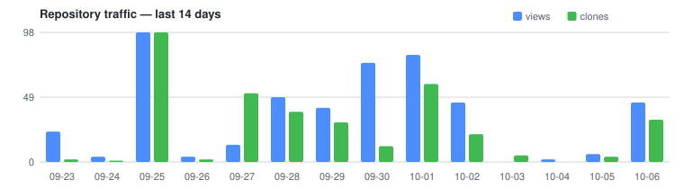
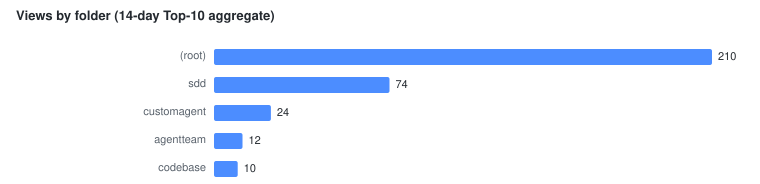
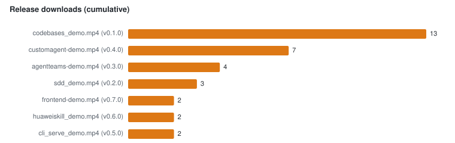

# Traffic Report

> Language: **English** ｜ [简体中文](report.zh-CN.md)

Auto-generated by `.github/scripts/collect_traffic.py` on 2026-10-08 — do not edit by hand. Raw data: [history.json](history.json).

## Last 14 days

| Views | View uniques | Clones | Clone uniques | Video downloads |
| ---: | ---: | ---: | ---: | ---: |
| 486 | 31 | 356 | 202 | 33 |

## Daily detail

| Date (UTC) | Views | View uniques | Clones | Clone uniques | Video downloads* |
| ---: | ---: | ---: | ---: | ---: | --- |
| 2026-10-06 | 45 | 3 | 32 | 18 | 33 |
| 2026-10-05 | 6 | 1 | 4 | 2 | – |
| 2026-10-04 | 2 | 2 | 0 | 0 | – |
| 2026-10-03 | 0 | 0 | 5 | 5 | – |
| 2026-10-02 | 45 | 5 | 21 | 13 | – |
| 2026-10-01 | 81 | 2 | 59 | 34 | – |
| 2026-09-30 | 75 | 3 | 12 | 8 | 27 |
| 2026-09-29 | 41 | 5 | 30 | 18 | – |
| 2026-09-28 | 49 | 3 | 38 | 24 | – |
| 2026-09-27 | 13 | 2 | 52 | 31 | – |
| 2026-09-26 | 4 | 1 | 2 | 2 | – |
| 2026-09-25 | 98 | 10 | 98 | 64 | – |
| 2026-09-24 | 4 | 2 | 1 | 1 | – |
| 2026-09-23 | 23 | 4 | 2 | 2 | – |
| 2026-09-22 | 12 | 7 | 0 | 0 | – |
| 2026-09-21 | 47 | 5 | 50 | 31 | – |
| 2026-09-20 | 0 | 0 | 0 | 0 | – |
| 2026-09-19 | 0 | 0 | 0 | 0 | – |
| 2026-09-18 | 0 | 0 | 0 | 0 | – |
| 2026-09-17 | 0 | 0 | 0 | 0 | – |
| 2026-09-16 | 0 | 0 | 0 | 0 | – |
| 2026-09-15 | 0 | 0 | 0 | 0 | – |

\* cumulative video downloads as of that day's snapshot; – = no snapshot collected that day.

## Popular folders & pages

Aggregated from GitHub's Top-10 pages snapshot of 2026-10-08 (a 14-day aggregate), so folder totals are lower bounds.

| Folder | Views | Uniques |
| --- | ---: | ---: |
| (repo root) | 228 | 41 |
| sdd | 74 | 15 |
| customagent | 14 | 4 |
| agentteam | 12 | 1 |
| codebase | 10 | 3 |

### Top pages

| Path | Views | Uniques |
| --- | ---: | ---: |
| `/tree/main` | 99 | 13 |
| `/` | 78 | 12 |
| `/blob/main/sdd/sdd_readme.zh-CN.md` | 48 | 10 |
| `/blob/main/README.zh-CN.md` | 40 | 11 |
| `/blob/main/customagent/docs/deep-research-custom-agent-demo.zh-CN.md` | 14 | 4 |
| `/blob/main/sdd/sdd_readme.en.md` | 14 | 3 |
| `/tree/main/sdd` | 12 | 2 |
| `/blob/main/agentteam/agentteam_readme.md` | 12 | 1 |
| `/blob/main/README.md` | 11 | 5 |
| `/blob/main/codebase/codebase_readme.md` | 10 | 3 |

## Release downloads

Cumulative per-asset download counts as of 2026-10-08.

| Tag | Asset | Downloads |
| --- | --- | ---: |
| v0.1.0 | `codebases_demo.mp4` | 13 |
| v0.4.0 | `customagent-demo.mp4` | 7 |
| v0.3.0 | `agentteams-demo.mp4` | 4 |
| v0.2.0 | `sdd_demo.mp4` | 3 |
| v0.7.0 | `frontend-demo.mp4` | 2 |
| v0.6.0 | `huaweiskill_demo.mp4` | 2 |
| v0.5.0 | `cli_serve_demo.mp4` | 2 |

**Total: 33**

